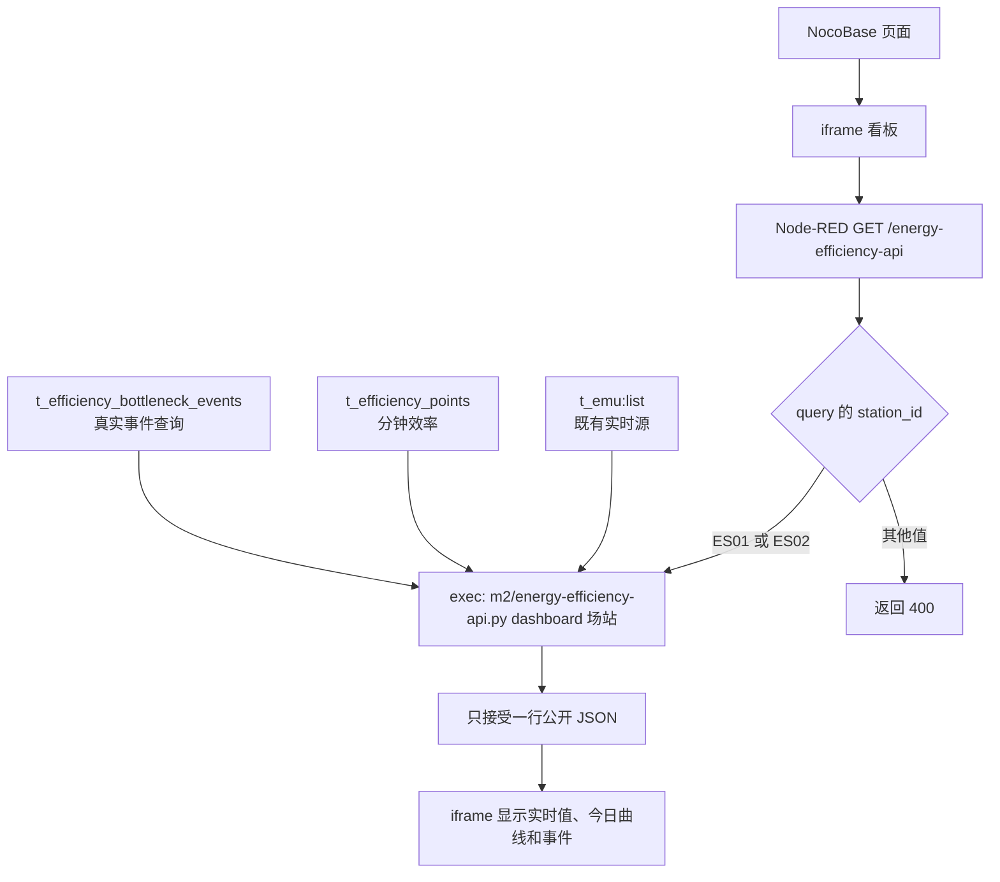
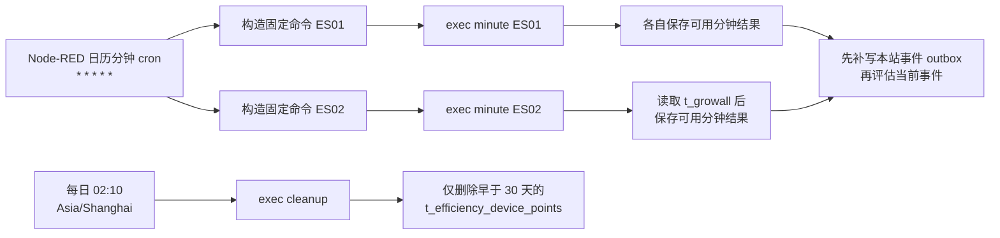
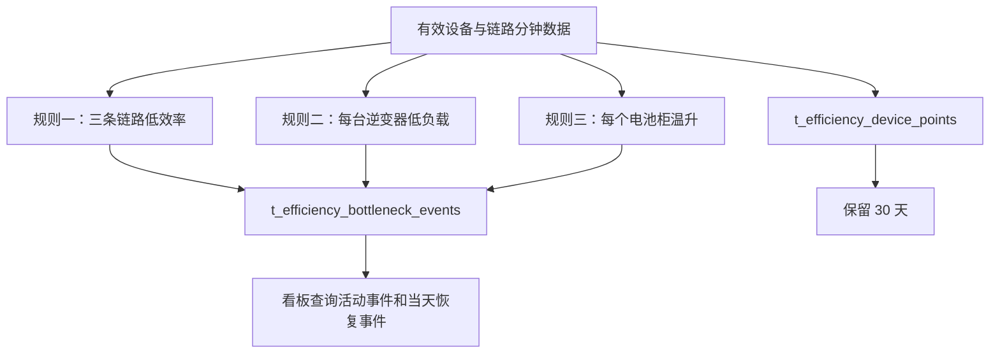

# M2 线上部署流程图

更新日期：2026-08-27

这份说明只描述要上传和启用的服务器流程。仓库里的 flow 已完成本地 JSON 和自动测试验证，但**尚未导入任何真实 Node-RED，也没有执行过生产分钟写入**。

## 1. 实际运行方式

Node-RED 是唯一对 iframe 开放的入口；不需要另起 Python HTTP 服务。服务器和 Node-RED 的时区必须都是 `Asia/Shanghai`。这样每天 02:10 的清理时间、页面当天范围和分钟桶才会一致。



`station_id` 仍由 URL query 读取；只允许 `ES01` 和 `ES02`，不是把 ES02 写死。Node-RED 不把令牌放进 flow，也不把脚本的原始 stdout/stderr 返回 HTTP 或直接写进调试栏：它只接受并记录最小的脱敏 JSON 摘要。

## 2. 定时任务和数据规则



两条分钟命令彼此独立：ES01 失败不会阻止 ES02，反之亦然。每次分钟处理读取 `t_emu`；ES02 还读取 `t_growall` 的 9 台逆变器。设备采样晚于计算时刻或超过 2 分钟时不参与该分钟。



三条规则是独立的：任意一条满足都可以产生事件，不需要同时满足。每日清理只动逐设备表 `t_efficiency_device_points`；不会删除 `t_efficiency_points` 或 `t_efficiency_bottleneck_events`。

事件 Upsert 失败时，分钟进程把最新事件 payload 写入本机 SQLite outbox；下一次同站 minute 在评估当前事件前先补写。返回中的 `event_update_count` 只是本轮规则计算出的更新数，不能当作成功写入数；以 `event_persistence.attempted/saved/failed/outbox_pending` 判断持久化结果。`failed` 或 `outbox_pending` 非零时应按 `partial` 处理。

## 3. 服务器要准备和上传的文件

在服务器创建目录，例如 `/userdata/holo/pyfiles/`。从同一个已测试版本上传：

- `m2/energy-efficiency-api.py`；
- 整个 `m2/` Python 包（至少包含 `__init__.py`、`station_energy_data_adapter.py`、`station_energy_backend.py`、`station_efficiency_device_adapter.py`、`station_efficiency_event_outbox.py`、`station_efficiency_history.py`、`station_efficiency_job.py`、`station_efficiency_nocobase.py` 和 `station_efficiency_bottlenecks.py`）；
- `m2/node_red/node-red-energy-efficiency-api-flow.json`，用于 Node-RED 导入；
- 如同一服务器托管看板，再上传 `m2/web/场站三条能效链路能流图.html`。

仓库本地配置位于根目录的 `.local/energy_efficiency_local_config.py`，**不上传 Git**。服务器按既有部署契约安装：将仓库的 `m2/energy-efficiency-api.py` 安装为 `/userdata/holo/pyfiles/energy-efficiency-api.py`，并将 Python 包安装到 `/userdata/holo/pyfiles/m2/`。服务器配置可放在 `/userdata/holo/pyfiles/.local/energy_efficiency_local_config.py`；兼容既有的入口同目录 `energy_efficiency_local_config.py`，两者同时存在时优先 `.local/`。Flow 中的生产绝对路径不随仓库目录迁移改变。可用环境变量替代其中任一敏感值；二者不要同时写两套不同令牌。

本地配置键如下（填真实值时不要贴到工单、flow 或文档）：

```python
EMU_URL = ""
EMU_TOKEN = ""
NOCOBASE_BASE_URL = ""
NOCOBASE_TOKEN = ""
TIMEZONE = "Asia/Shanghai"
REQUEST_TIMEOUT_SECONDS = 15
GROWALL_URL = ""
GROWALL_TOKEN = ""
PV_INVERTER_SNS_BY_STATION = {"ES02": ("emu1", "emu2", "emu3", "emu4", "emu5", "emu21", "emu22", "emu23", "emu24")}
PV_INVERTER_RATED_POWER_KW = 60
DEVICE_SAMPLE_MAX_AGE_MINUTES = 2
DEVICE_POINT_RETENTION_DAYS = 30
BATTERY_MAX_TEMPERATURE_FIELD = "max_temp"
BATTERY_HOT_CLUSTER_FIELD = ""
```

outbox 路径的本地配置键名是 `EVENT_OUTBOX_PATH`，环境变量键名是 `M2_EVENT_OUTBOX_PATH`；本说明不记录现场路径值。两者均未提供时，本地默认使用仓库根目录的 `runtime/m2/energy_efficiency_event_outbox.sqlite3`；按上述服务器契约安装时默认位于 `/userdata/holo/pyfiles/runtime/m2/energy_efficiency_event_outbox.sqlite3`。升级既有安装须保留原 `M2_EVENT_OUTBOX_PATH` / `EVENT_OUTBOX_PATH` 配置，继续使用原 outbox 文件，避免遗漏待补写事件。

不要填写空的 `BOTTLENECK_RULES`：省略该键会使用代码内置的正式默认规则。`PV_INVERTER_RATED_POWER_KW` 虽保留兼容配置入口，但只能是数值 `60`，其他值会作为安全配置错误拒绝。已确认 `t_emu` 的电池柜最高温度字段为 `max_temp`，因此 `BATTERY_MAX_TEMPERATURE_FIELD` 使用 `"max_temp"`；`BATTERY_HOT_CLUSTER_FIELD` 在未确认字段前保持空值。温度缺失或非法时仍按 `null` 处理，不会当成 0。其他环境变量名称见程序：`VIFA_EMU_URL`、`VIFA_EMU_TOKEN`、`M2_NOCOBASE_BASE_URL`、`M2_NOCOBASE_TOKEN`、`M2_TIMEZONE`、`M2_REQUEST_TIMEOUT_SECONDS`、`VIFA_GROWALL_URL`/`M2_GROWALL_URL`、`VIFA_GROWALL_TOKEN`/`M2_GROWALL_TOKEN`，以及各 `M2_*` 数值项。

Node-RED 运行用户必须对 outbox 文件所在目录有创建、读写和重命名权限，因为 SQLite 运行时还会创建同名 `-wal`、`-shm` 辅助文件。目录不得放 Token 或其他秘密，异常只返回固定脱敏提示。上线备份必须包含 outbox：优先用 SQLite 在线备份；若采用文件复制，先禁用两站 minute 并 Deploy，确认无进程写入后连同主文件及存在的 `-wal`、`-shm` 一起复制，不能在运行中只复制主文件。

## 4. 导入和启用 flow

1. 先在 Node-RED 菜单导出当前 flow，保存为“启用前备份”。
2. 确认 Node-RED 进程时区是 `Asia/Shanghai`，并确认它能读取 `/userdata/holo/pyfiles/energy-efficiency-api.py` 及同目录配置、能写 outbox 所在目录。
3. 菜单选择“导入”，导入 `node-red-energy-efficiency-api-flow.json`，检查组“能效分析API”内有看板、每分钟和每日清理三段。导入后的“每分钟触发”和“每日清理30天前设备点”默认是**禁用**的；保持禁用，不要点击它们。
4. 可以先 Deploy：禁用的 inject 不会在导入、Deploy 或 Node-RED 重启后写入或清理数据。确认 HTTP 节点路径仍是 `GET /energy-efficiency-api`；不修改为 ES02，也不在 exec 命令后追加 token。
5. 完成下面的 HTTP 只读检查和单站人工写入核对后，才回到编辑器逐个启用 inject 并再次 Deploy。

## 5. 先做只读和看板验证

以下命令在仓库根目录执行；服务器应使用既有安装路径 `/userdata/holo/pyfiles/energy-efficiency-api.py`。操作只读且每次都应只输出一行 JSON：

```bash
python3 m2/energy-efficiency-api.py dashboard ES01
python3 m2/energy-efficiency-api.py dashboard ES02
```

检查两条命令都没有输出 token、密码或完整授权头。然后访问：

```text
/energy-efficiency-api?station_id=ES01
/energy-efficiency-api?station_id=ES02
```

应能分别显示对应场站；`station_id=ES03` 应返回 400。此阶段不触发 `minute` 或 `cleanup`，所以不会写入或删除数据。

事件列表当前为空也只证明 dashboard 读取路径可用，不能证明事件表允许写入 `chain_low_efficiency`，也不能证明设备点组合唯一键已经生效。

## 6. 分钟写入验证的安全停点

只有在测试环境、数据表和权限已由现场人员确认后，才可进行人工写入。第一次 minute 前必须由现场人员核对：

1. `t_efficiency_bottleneck_events.event_type` 的字段/枚举允许值包含 `chain_low_efficiency`；
2. `t_efficiency_device_points` 已存在 `(station_id, device_type, device_id, data_time)` 组合唯一键；
3. Node-RED 用户能写 outbox 目录，并已纳入受控备份。

任一项未确认就停在这里，不得用空事件 dashboard 代替写入前置核对。先不要在编辑器启用分钟 inject；确认后才可在服务器终端只运行一个场站，例如：

```bash
python3 m2/energy-efficiency-api.py minute ES01
```

核对 ES01 对应分钟桶的 `t_efficiency_points`，以及有有效采样时的 `t_efficiency_device_points`；重复同一分钟不应产生重复行。ES01 核对完成并获准后，再单独运行 `minute ES02` 并作同样核对。

**安全停点：** 每个单站核对后立即停止；不要启用自动 cron，也不要点击每日清理。记录结果、报错的脱敏摘要和表中行数后，交由现场负责人决定是否继续。每日清理只应在已确认设备点历史超过 30 天、且已备份/审批后再单独手工验证。

## 7. 启用、观察和回滚

得到明确许可后回到 Node-RED 编辑器：先启用“每分钟触发”并 Deploy，观察一个完整分钟边界，确认 ES01 和 ES02 的脱敏结果各自出现；每日清理仍保持禁用。确认分钟任务稳定、且再次获得清理许可后，再单独启用“每日清理30天前设备点”并 Deploy；在次日 02:10 后检查清理结果。任何一站失败时，另一站仍应继续运行。

需要回滚时：

1. 立即禁用或移除本组的分钟和每日 inject 节点并部署，先停止后续写入/清理；
2. 导入第 4 节保存的“启用前备份”并部署；
3. 恢复同一份已测试的 Python 文件、本地配置和 outbox 备份；恢复 outbox 前保持 minute 禁用，避免覆盖尚未补写的事件；
4. 保留 Node-RED 的脱敏错误摘要和时间，不要复制原始 stderr 或凭据到问题单。

回滚不会自动删除已经写入的分钟点、设备点或事件；是否清理已有测试记录必须由有数据权限的现场人员单独决定。
