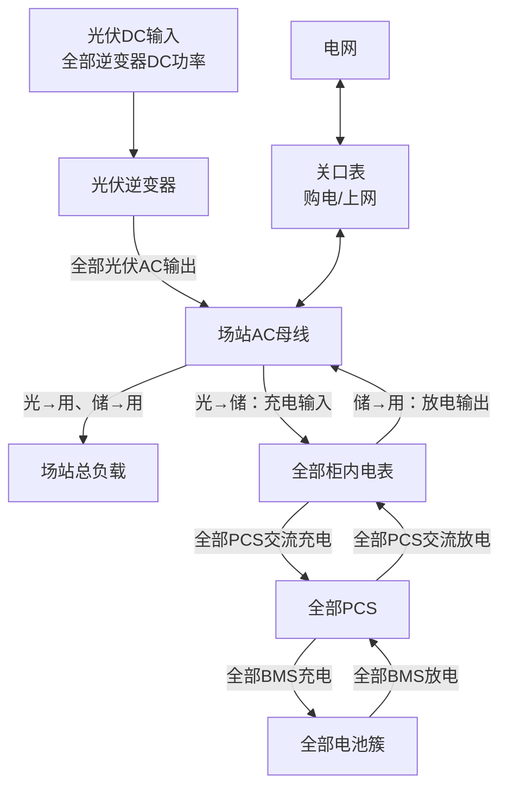

# 场站级三条能效链路后端计算表

## 1. 计算范围

本文用于后端计算以下三条场站级能效链路：

1. 光→储：光伏向储能电池充电；
2. 储→用：储能电池放电并向负载供电；
3. 光→用：光伏直接向负载供电。

推荐计算流程：

```text
数据归一化 → 按母线汇总 → 判断运行方向 → 分配能源来源 → 计算链路效率 → 校验数据质量 → 按时间积分
```

> 场站内如果存在多段互不连通的交流母线，应先按电站或母线分别计算能量，再汇总能量结果。不能把不同母线的功率直接混合计算，也不能直接平均各电站的效率。

## 2. 场站拓扑



## 3. 场站级输入数据表

| 后端字段 | 数据来源 | 汇总方式 | 主要用途 |
|---|---|---|---|
| `pv_dc_power` | 全部光伏逆变器DC输入 | 同母线设备求和 | 计算包含光伏逆变器的完整效率 |
| `pv_ac_power` | 全部光伏逆变器AC输出 | 同母线设备求和 | 场站实际光伏交流发电功率 |
| `load_power` | 场站负载总表或全部负载表 | 求和或总表直读 | 计算光→用、储→用及光伏余量 |
| `cabinet_charge_power` | 全部柜内电表 | 充电方向求和 | 储能柜从AC母线吸收的总功率 |
| `cabinet_discharge_power` | 全部柜内电表 | 放电方向求和 | 储能柜送入AC母线的总功率 |
| `pcs_charge_power` | 全部PCS | 交流充电方向求和 | 计算PCS充电转换效率 |
| `pcs_discharge_power` | 全部PCS | 交流放电方向求和 | 计算PCS放电转换效率 |
| `bms_charge_power` | 全部电池簇BMS | 充电方向求和 | 电池直流端实际接收功率 |
| `bms_discharge_power` | 全部电池簇BMS | 放电方向求和 | 电池直流端实际输出功率 |
| `grid_import_power` | 关口表 | 购电方向取正值 | 电网进入场站的功率 |
| `grid_export_power` | 关口表 | 上网方向取正值 | 场站送入电网的功率 |
| `device_status` | PCS、BMS、逆变器 | 状态汇总 | 判断充电、放电、待机和异常 |
| `data_time` | 所有设备 | 对齐到统一时间窗口 | 防止不同时间的数据混算 |

### 3.1 负载口径

`load_power`应表示生产负载或用户负载，不应再次包含已经由柜内电表统计的储能充电功率，否则会重复计算。

柜内空调、风机、控制器等辅助用电如果已经包含在柜内电表中，则不再加入场站负载；如果柜内电表不包含辅助用电，则应单独增加`storage_aux_power`。

## 4. 功率方向归一化

不同厂家设备的功率正负号定义可能不同。原始数据进入计算前，必须转换成统一的非负方向字段。

| 原始运行方向 | 后端归一化字段 |
|---|---|
| BMS处于充电 | `bms_charge_power` |
| BMS处于放电 | `bms_discharge_power` |
| PCS从母线吸收功率 | `pcs_charge_power` |
| PCS向母线输出功率 | `pcs_discharge_power` |
| 柜内电表从母线取电 | `cabinet_charge_power` |
| 柜内电表向母线送电 | `cabinet_discharge_power` |
| 关口表从电网取电 | `grid_import_power` |
| 关口表向电网上网 | `grid_export_power` |

例如，某厂家定义BMS充电功率为负数，则归一化为：

$$
P_{\mathrm{BMS,Chg}}=|P_{\mathrm{BMS,Raw}}|
$$

不能直接使用设备原始正负号进行场站汇总。

## 5. 场站汇总计算表

| 汇总指标 | 后端计算公式 |
|---|---|
| 光伏DC总功率 | $P_{\mathrm{PV,DC}}=\sum P_{\mathrm{PVInv,DC},i}$ |
| 光伏AC总功率 | $P_{\mathrm{PV,AC}}=\sum P_{\mathrm{PVInv,AC},i}$ |
| 柜内电表充电总功率 | $P_{\mathrm{Cab,Chg}}=\sum P_{\mathrm{CabMeter,Chg},i}$ |
| 柜内电表放电总功率 | $P_{\mathrm{Cab,Dis}}=\sum P_{\mathrm{CabMeter,Dis},i}$ |
| PCS交流充电总功率 | $P_{\mathrm{PCS,Chg}}=\sum P_{\mathrm{PCS,AC,Chg},i}$ |
| PCS交流放电总功率 | $P_{\mathrm{PCS,Dis}}=\sum P_{\mathrm{PCS,AC,Dis},i}$ |
| BMS充电总功率 | $P_{\mathrm{BMS,Chg}}=\sum P_{\mathrm{BMS,Chg},i}$ |
| BMS放电总功率 | $P_{\mathrm{BMS,Dis}}=\sum P_{\mathrm{BMS,Dis},i}$ |

只累加设备当前方向对应的有效功率。处于待机、通信中断或数据质量异常的设备不得使用历史值补入实时计算。

## 6. 场站功率平衡

场站交流母线功率平衡为：

$$
P_{\mathrm{PV,AC}}
+P_{\mathrm{Grid,Import}}
+P_{\mathrm{Cab,Dis}}
=P_{\mathrm{Load}}
+P_{\mathrm{Cab,Chg}}
+P_{\mathrm{Grid,Export}}
+P_{\mathrm{Loss}}
$$

功率平衡差值：

$$
\Delta P=
P_{\mathrm{PV,AC}}
+P_{\mathrm{Grid,Import}}
+P_{\mathrm{Cab,Dis}}
-P_{\mathrm{Load}}
-P_{\mathrm{Cab,Chg}}
-P_{\mathrm{Grid,Export}}
$$

功率平衡误差率：

$$
E_{\mathrm{Balance}}
=\frac{|\Delta P|}
{\max(P_{\mathrm{PV,AC}}+P_{\mathrm{Grid,Import}}+P_{\mathrm{Cab,Dis}},P_{\min})}
\times100\%
$$

其中$P_{\min}$为防止分母过小设置的最小功率阈值。

## 7. 能源来源分配

以下公式基于“光伏优先供负载，光伏余量充储；储能其次供负载；电网最后补充”的统计口径。如果客户EMS策略不同，后端分配顺序必须同步修改。

### 7.1 光伏和电网向储能充电

| 计算项 | 后端计算公式 |
|---|---|
| 光伏余量 | $P_{\mathrm{PV,Surplus}}=\max(P_{\mathrm{PV,AC}}-P_{\mathrm{Load}},0)$ |
| 光伏进入储能柜 | $P_{\mathrm{PV\to Sto}}=\min(P_{\mathrm{PV,Surplus}},P_{\mathrm{Cab,Chg}})$ |
| 电网进入储能柜 | $P_{\mathrm{Grid\to Sto}}=\max(P_{\mathrm{Cab,Chg}}-P_{\mathrm{PV\to Sto}},0)$ |
| 储能充电光伏占比 | $R_{\mathrm{PV,Sto}}=P_{\mathrm{PV\to Sto}}/P_{\mathrm{Cab,Chg}}$ |
| 储能充电电网占比 | $R_{\mathrm{Grid,Sto}}=P_{\mathrm{Grid\to Sto}}/P_{\mathrm{Cab,Chg}}$ |

如果场站存在独立辅助负载，应先从光伏余量中扣除该部分功率。

### 7.2 光伏、储能和电网向负载供电

| 计算项 | 后端计算公式 |
|---|---|
| 光伏供负载 | $P_{\mathrm{PV\to Load}}=\min(P_{\mathrm{PV,AC}},P_{\mathrm{Load}})$ |
| 光伏供电后剩余负载 | $P_{\mathrm{Load,Remain}}=\max(P_{\mathrm{Load}}-P_{\mathrm{PV\to Load}},0)$ |
| 储能供负载 | $P_{\mathrm{Sto\to Load}}=\min(P_{\mathrm{Cab,Dis}},P_{\mathrm{Load,Remain}})$ |
| 电网供负载 | $P_{\mathrm{Grid\to Load}}=\max(P_{\mathrm{Load}}-P_{\mathrm{PV\to Load}}-P_{\mathrm{Sto\to Load}},0)$ |

在共享交流母线中，上述来源属于统计归属，并不是对电子来源的物理追踪。

## 8. 三条能效链路计算表

| 链路 | 分子 | 分母 | 后端计算公式 | 计算条件 |
|---|---|---|---|---|
| 光→储（AC侧） | 光伏归属的BMS充电功率 | 光伏实际进入储能柜的AC功率 | $\eta_{\mathrm{PVAC\to Sto}}=P_{\mathrm{BMS,PV}}/P_{\mathrm{PV\to Sto}}$ | 储能处于充电状态且来源可分配 |
| 光→储（DC侧） | 光伏归属的BMS充电功率 | 分配给储能的光伏DC功率 | $\eta_{\mathrm{PVDC\to Sto}}=P_{\mathrm{BMS,PV}}/P_{\mathrm{PVDC\to Sto}}$ | 光伏DC、AC数据均有效 |
| 储→用 | 负载中归属于储能的功率 | 归属于负载的BMS放电功率 | $\eta_{\mathrm{Sto\to Load}}=P_{\mathrm{Sto\to Load}}/P_{\mathrm{BMS,Load}}$ | 储能处于放电状态且流向可分配 |
| 光→用（AC侧） | 负载中归属于光伏的实际功率 | 光伏AC分配给负载的功率 | $\eta_{\mathrm{PVAC\to Load}}=P_{\mathrm{Load,PV}}/P_{\mathrm{PVAC\to Load}}$ | 光伏正在供负载 |
| 光→用（DC侧） | 负载中归属于光伏的实际功率 | 光伏DC分配给负载的功率 | $\eta_{\mathrm{PVDC\to Load}}=P_{\mathrm{Load,PV}}/P_{\mathrm{PVDC\to Load}}$ | 光伏DC、AC数据均有效 |

## 9. 混合能源分摊

### 9.1 光伏与电网混合充电

光伏归属的BMS充电功率：

$$
P_{\mathrm{BMS,PV}}
=P_{\mathrm{BMS,Chg}}
\times\frac{P_{\mathrm{PV\to Sto}}}{P_{\mathrm{Cab,Chg}}}
$$

电网归属的BMS充电功率：

$$
P_{\mathrm{BMS,Grid}}
=P_{\mathrm{BMS,Chg}}
\times\frac{P_{\mathrm{Grid\to Sto}}}{P_{\mathrm{Cab,Chg}}}
$$

这是按照输入功率占比进行的统计分摊，结果应标记为`estimated`。

### 9.2 储能同时供负载和上网

归属于负载的BMS放电功率：

$$
P_{\mathrm{BMS,Load}}
=P_{\mathrm{BMS,Dis}}
\times\frac{P_{\mathrm{Sto\to Load}}}{P_{\mathrm{Cab,Dis}}}
$$

这样可以避免把储能上网部分错误地算入“储→用”链路。

## 10. 分段设备效率

| 指标 | 后端计算公式 | 含义 |
|---|---|---|
| 光伏逆变器效率 | $\eta_{\mathrm{PVInv}}=P_{\mathrm{PV,AC}}/P_{\mathrm{PV,DC}}$ | 光伏DC到AC的转换效率 |
| PCS充电效率 | $\eta_{\mathrm{PCS,Chg}}=P_{\mathrm{BMS,Chg}}/P_{\mathrm{PCS,Chg}}$ | PCS交流输入到电池直流端的效率 |
| 储能柜充电效率 | $\eta_{\mathrm{Cab,Chg}}=P_{\mathrm{BMS,Chg}}/P_{\mathrm{Cab,Chg}}$ | 包含柜内辅助用电的充电效率 |
| PCS放电效率 | $\eta_{\mathrm{PCS,Dis}}=P_{\mathrm{PCS,Dis}}/P_{\mathrm{BMS,Dis}}$ | 电池直流输出到PCS交流输出的效率 |
| 储能柜放电效率 | $\eta_{\mathrm{Cab,Dis}}=P_{\mathrm{Cab,Dis}}/P_{\mathrm{BMS,Dis}}$ | 包含柜内辅助用电的放电效率 |

## 11. 示例A：光→储

### 11.1 输入数据

| 输入数据 | 数值 |
|---|---:|
| 光伏AC输出 | 183 kW |
| 场站总负载 | 80 kW |
| 柜内电表充电总功率 | 103 kW |
| PCS交流充电总功率 | 100 kW |
| BMS充电总功率 | 95 kW |
| 关口表购电 | 0 kW |
| 关口表上网 | 0 kW |

光伏进入储能柜：

$$
P_{\mathrm{PV\to Sto}}=183-80=103\ \mathrm{kW}
$$

### 11.2 输出结果

| 输出指标 | 数值 |
|---|---:|
| 光伏进入储能柜 | 103 kW |
| 电网进入储能柜 | 0 kW |
| 光伏充电占比 | 100% |
| PCS充电效率 | 95.00% |
| 光→储整柜效率 | 92.23% |

$$
\eta_{\mathrm{PVAC\to Sto}}
=\frac{95}{103}\times100\%
=92.23\%
$$

## 12. 示例B：储→用

### 12.1 输入数据

| 输入数据 | 数值 |
|---|---:|
| 光伏AC输出 | 0 kW |
| BMS放电总功率 | 100 kW |
| PCS交流放电总功率 | 95 kW |
| 柜内电表净输出 | 92 kW |
| 负载实际接收 | 90 kW |
| 电网购电/上网 | 0 kW |

### 12.2 输出结果

| 输出指标 | 数值 |
|---|---:|
| PCS放电效率 | 95.00% |
| 储能柜放电效率 | 92.00% |
| 储→用链路效率 | 90.00% |

$$
\eta_{\mathrm{Sto\to Load}}
=\frac{90}{100}\times100\%
=90.00\%
$$

如果分子采用PCS交流输出功率，则计算结果只是PCS放电转换效率，而不是完整的储→用链路效率。

## 13. 示例C：光→用

### 13.1 输入数据

| 输入数据 | 数值 |
|---|---:|
| 光伏DC输入 | 100 kW |
| 光伏AC输出 | 96 kW |
| 负载实际接收 | 94 kW |
| 储能充放电 | 0 kW |
| 电网购电/上网 | 0 kW |

### 13.2 输出结果

| 输出指标 | 数值 |
|---|---:|
| 光伏逆变器效率 | 96.00% |
| 光→用AC侧效率 | 97.92% |
| 光→用DC侧完整效率 | 94.00% |

$$
\eta_{\mathrm{PVAC\to Load}}
=\frac{94}{96}\times100\%
=97.92\%
$$

$$
\eta_{\mathrm{PVDC\to Load}}
=\frac{94}{100}\times100\%
=94.00\%
$$

## 14. 示例D：多能源同时供负载

### 14.1 输入数据

| 输入数据 | 数值 |
|---|---:|
| 场站总负载 | 150 kW |
| 光伏AC输出 | 80 kW |
| 储能柜放电输出 | 50 kW |
| 关口表购电 | 20 kW |

### 14.2 来源分配

$$
P_{\mathrm{PV\to Load}}=80\ \mathrm{kW}
$$

$$
P_{\mathrm{Sto\to Load}}=50\ \mathrm{kW}
$$

$$
P_{\mathrm{Grid\to Load}}=20\ \mathrm{kW}
$$

| 负载来源 | 功率 | 占比 |
|---|---:|---:|
| 光伏 | 80 kW | 53.33% |
| 储能 | 50 kW | 33.33% |
| 电网 | 20 kW | 13.34% |

该分配结果应标记为`estimated`，并记录使用的能源优先级规则。

## 15. 后端有效性判断表

| 判断条件 | 后端处理 | 质量标记 |
|---|---|---|
| 输入功率低于最小阈值 | 不计算效率 | `low_power` |
| 分母为0 | 返回空值，不返回0% | `zero_denominator` |
| 效率小于0或明显超过100% | 不输出正常效率 | `invalid_efficiency` |
| PCS与BMS方向不一致 | 暂停该柜计算 | `direction_conflict` |
| 不同电池簇同时充电和放电 | 暂停整柜链路计算 | `mixed_battery_direction` |
| 数据不在同一时间窗口 | 暂停计算 | `time_misaligned` |
| 场站功率平衡误差超限 | 保留原始数据但不输出可信效率 | `power_balance_error` |
| 多种能源同时供电 | 允许按规则分摊 | `estimated` |
| 单一能源且计量点完整 | 正常计算 | `measured` |
| 设备告警或通信中断 | 暂停相关链路计算 | `device_abnormal` |

最小计算功率阈值建议配置化，可以根据设备额定功率设置，例如额定功率的5%。低功率阶段受待机功耗和仪表误差影响较大，不宜计算实时效率。

## 16. 实时与24小时效率

| 统计类型 | 正确计算方式 |
|---|---|
| 实时效率 | 使用同一时间窗口内的输入、输出平均功率计算 |
| 5分钟效率 | 5分钟输出电量除以5分钟输入电量 |
| 24小时效率 | 24小时输出电量总和除以24小时输入电量总和 |
| 不推荐方式 | 对所有瞬时效率直接求算术平均 |

24小时效率应按能量累计计算：

$$
\eta_{24h}
=\frac{\sum P_{\mathrm{Out},i}\Delta t_i}
{\sum P_{\mathrm{In},i}\Delta t_i}
\times100\%
$$

不能直接计算：

$$
\frac{\eta_1+\eta_2+\cdots+\eta_n}{n}
$$

## 17. 建议后端输出字段

| 输出字段 | 含义 |
|---|---|
| `pv_to_storage_power` | 光伏进入储能柜的功率 |
| `grid_to_storage_power` | 电网进入储能柜的功率 |
| `pv_to_load_power` | 光伏归属的负载功率 |
| `storage_to_load_power` | 储能归属的负载功率 |
| `grid_to_load_power` | 电网归属的负载功率 |
| `pv_storage_efficiency` | 光→储链路效率 |
| `storage_load_efficiency` | 储→用链路效率 |
| `pv_load_efficiency` | 光→用链路效率 |
| `pv_inverter_efficiency` | 光伏逆变器效率 |
| `pcs_charge_efficiency` | PCS充电转换效率 |
| `pcs_discharge_efficiency` | PCS放电转换效率 |
| `cabinet_charge_efficiency` | 储能柜整体充电效率 |
| `cabinet_discharge_efficiency` | 储能柜整体放电效率 |
| `power_balance_error` | 场站功率平衡误差率 |
| `calculation_mode` | `measured`或`estimated` |
| `quality_code` | 无效、低功率、时间错位等质量标记 |
| `calculated_at` | 计算时间 |

## 18. 关键结论

1. 后端必须先统一设备功率方向，再进行场站汇总。
2. 光伏总输出不能直接作为光→储或光→用的分母，必须先确定实际分配功率。
3. BMS充放电功率必须汇总场站内所有有效电池簇。
4. 柜内电表用于计算包含辅助用电的储能柜整体效率。
5. 关口表用于判断场站购电和上网，并校验能源来源分配。
6. 共享交流母线下的混合能源来源属于统计分摊，应标记为`estimated`。
7. 实时效率使用同一时间窗口的数据；日效率必须通过输入、输出电量累计计算。
8. 多电站或多母线场景应先分母线计算，再汇总能量，不能直接平均效率。
