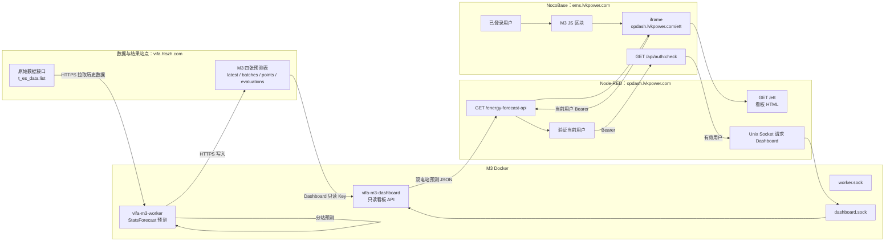

# M3 生产部署架构与人工导入包设计（已废弃）

> 现行生产方案已改为 AMD64 三域普通 iframe Header 架构，见
> `2026-08-28-m3-amd64-three-domain-iframe-design.md`。本文件保留为历史记录，不再实施。

日期：2026-08-28\
状态：已废弃

## 1. 目标与交付范围

为 M3 双电站负荷预测提供一套不依赖 Nginx、不重启 Node-RED、不修改 M1/M2 的生产部署
交付包。操作员通过 Node-RED 编辑器人工导入 Flow JSON，并在 NocoBase 页面人工创建 JS
区块。M3 四张表已经存在，本交付不创建、删除或修改表结构。

交付文件：

- `m3/部署架构流程图.md`：部署架构图、预测写入流程、看板认证时序、导入和回滚流程；
- `m3/node_red/m3_production_gateway_flow.json`：可由 Node-RED 编辑器直接导入的生产 Flow；
- `docs/m3/nocobase/m3_nocobase_iframe_manifest.json`：NocoBase 人工配置与验收清单；
- `docs/m3/nocobase/m3_forecast_iframe_block.production.js`：粘贴到生产 NocoBase JS 区块的代码；
- `m3/人工部署手册.md`：从镜像导入、代码上传、生产配置、Docker 启动、人工导入、验证到
  生产回滚的可直接执行操作手册。

NocoBase manifest 是人工配置清单，不伪装成 NocoBase 页面导入文件。NocoBase 官方通用页面配置
迁移使用 Migration Manager 生成的 `.nbdata`，而全量备份恢复会覆盖目标应用；二者均不适合本次
现有生产应用的轻量增量发布。

## 2. 已确认的站点职责

| 站点 | 职责 | 不承担的职责 |
|---|---|---|
| `https://vifa.hlszh.com` | 提供原始 `t_es_data:list`；保存并提供 M3 四表数据 | 不作为生产页面当前用户认证站点 |
| `https://ems.lvkpower.com` | 承载 NocoBase 页面、当前登录用户及 `GET /api/auth:check` | 不直接运行 M3 Python 预测 |
| `https://opdash.lvkpower.com` | Node-RED 暴露 `/ett` 与 `/energy-forecast-api` | 不保存浏览器 Token，不直接保存预测数据 |

三个域名必须使用 HTTPS。配置中统一使用无末尾 `/` 的 origin。

## 3. 总体架构



Node-RED 不运行预测。常驻 Worker 独立调度 StatsForecast，分开处理两个电站并将结果通过
HTTP 写入四表。Dashboard 容器只读四表，通过 Unix Socket 对 Node-RED 提供聚合结果。

生产 Node-RED 与生产 M3 Docker 必须位于同一台主机，并共同访问宿主机
`/userdata/holo/pyfiles/vifa-m3/run`；Unix Socket 不能跨主机访问。

## 4. Token 与信任边界

| 凭据 | 存放位置 | 使用方 | 浏览器可见 |
|---|---|---|---|
| 原始数据读取 Token | root-only secret file | Worker | 否 |
| 四表写入 Key | `/etc/vifa-m3/m3.env` | Worker | 否 |
| 四表只读 Key | `/etc/vifa-m3/dashboard.env` | Dashboard | 否 |
| Worker 管理 Key | `/etc/vifa-m3/m3.env` | 运维调用 | 否 |
| 当前用户 Bearer | NocoBase/iframe 运行时内存 | Node-RED 调用 `ems` 鉴权 | 是，仅内存 |

当前用户 Token 不得进入 URL、DOM、`localStorage`、`sessionStorage`、Flow 环境变量、文件或
日志。Node-RED 完成 `auth:check` 后立即删除消息中的 Authorization，不能将它传给 Python。

## 5. Node-RED Flow 设计

导入文件只使用 Node-RED 核心节点：`http in`、`http response`、`http request`、`function`、
`template`、`exec`、`join`、`inject` 和 `catch`。不要求安装第三方 palette 节点。

### 5.1 Flow 级非敏感配置

```text
M3_AUTH_MODE=postmessage
M3_AUTH_BASE_URL=https://ems.lvkpower.com
M3_NOCOBASE_PAGE_ORIGIN=https://ems.lvkpower.com
```

认证地址使用新的 `M3_AUTH_BASE_URL`。Node-RED 不再使用 `M3_NOCOBASE_BASE_URL` 做当前用户
认证，以免与 Dashboard/Worker 的四表地址 `https://vifa.hlszh.com` 混淆。

### 5.2 `GET /ett`

- 只接受 GET，拒绝所有 query；
- 校验 `M3_AUTH_MODE` 必须等于 `postmessage`；
- 校验父页面 origin 必须是无路径、query、fragment、用户名和密码的 HTTP(S) origin；
- 注入认证模式和精确父 origin 后返回内嵌看板 HTML；
- 设置 `Cache-Control: no-store`、`X-Content-Type-Options: nosniff`、
  `Referrer-Policy: no-referrer`；
- CSP 至少包含 `default-src 'none'`、同源连接限制及
  `frame-ancestors https://ems.lvkpower.com`。

HTML 保持固定同源 `GET /energy-forecast-api`、10 秒超时、60 秒可见页面刷新和最近一次成功
结果保留行为。

### 5.3 `GET /energy-forecast-api`

1. 拒绝 query 和不符合 `Bearer` 合同的 Authorization；
2. 只调用固定 `M3_AUTH_BASE_URL/api/auth:check`；
3. 401/403 映射为 401，其他非 2xx 映射为 503；
4. 只接受不超过 64 KiB 且 `payload.data.id` 为正整数的响应；
5. 删除浏览器 Authorization 和上游响应元数据；
6. 运行固定命令：
   `/usr/bin/curl --fail --silent --show-error --connect-timeout 2 --max-time 30 --unix-socket /userdata/holo/pyfiles/vifa-m3/run/dashboard.sock http://localhost/dashboard`；
7. stdout 上限为 4 MiB，只接受单个合法 JSON envelope；
8. 返回 200，或返回不泄露上游正文、stderr、路径和堆栈的固定错误。

固定错误映射：无效/过期用户 401；认证服务不可用 503；Dashboard 不可用或合同错误 502；
Unix Socket 请求超时 504。所有 JSON 响应使用 `Cache-Control: no-store`。

### 5.4 健康检查

每 60 秒通过固定 Worker Unix Socket 请求 `/health`。连续三次非正常结果后仅写 Node-RED
warning，不进行自动重启、Docker 操作或外部通知。

### 5.5 导入和回滚

操作员把 JSON 导入为新 Flow。部署前必须搜索所有 `http in` 节点，确保启用状态下只有一个
`/ett` 和一个 `/energy-forecast-api`。旧 `energy_forecast_flow.json` 不得导入。

在同一次待发布修改中停用/删除旧 M3 路由并启用新 Flow，选择 `Deploy -> Modified Nodes`。
不得重启 Node-RED。回滚时停用新 M3 Flow、恢复旧 M3 节点并再次部署 Modified Nodes；M1/M2
和非 M3 Flow 不得修改。

Flow 级环境变量是 Node-RED JSON 的一部分。生产部署不得创建 `/etc/vifa-m3/nodered.env`、
systemd drop-in 或 Node-RED 专用配置目录，也不得执行 `systemctl daemon-reload` 或
`systemctl restart nodered.service`。服务器准备脚本只负责 M3 Docker 目录、Socket 目录和
root-only Worker/Dashboard 配置目录。

## 6. NocoBase JS 区块设计

生产区块固定创建 `https://opdash.lvkpower.com/ett` iframe。URL 不得包含 query、fragment、
用户名或密码。iframe 使用：

```text
sandbox="allow-scripts allow-same-origin"
referrerPolicy="no-referrer"
```

区块通过 `await ctx.getVar("ctx.token")` 获取当前用户 Token。子 iframe 生成一次性 32 位
十六进制 nonce，并向精确父 origin 发送 `vifa-m3-auth-ready`。父区块只在
`event.source === iframe.contentWindow` 且 `event.origin === https://opdash.lvkpower.com`
时，以相同 nonce 回传 `vifa-m3-auth-token`。双方都禁止 `postMessage(..., "*")`。

区块重跑时必须移除旧监听器并清空旧 Token；清理时移除 iframe。任何配置或认证错误只显示
固定中文错误，不打印 Token 或异常详情。所有能打开该页面且当前登录有效的用户都能查看全部
已配置电站，不实施站点级权限划分。

## 7. NocoBase Manifest 合同

`m3_nocobase_iframe_manifest.json` 是 UTF-8 严格 JSON，包含：

- `kind` 和整数 `version`；
- 三个固定 origin/URL；
- `authenticated_users` 受众和 `all_configured_stations` 范围；
- JS 区块标题、源文件相对路径及固定 iframe URL；
- Token 内存隔离、精确 source/origin、nonce 和 iframe sandbox 安全断言；
- 人工安装步骤；
- `auth:check`、路由唯一性、页面展示、浏览器网络与回滚验收项；
- 明确标注 `importable: false`，防止被误当成 NocoBase 原生页面导入文件。

JSON 不得包含 Token、密码、Cookie、Authorization 示例值或数据库连接串。

## 8. 阶段边界

本次交付覆盖普通预测、四表写入和双电站看板。第一阶段不得宣称已经开始或通过连续七日验收。
验收上下文与告警上游尚不存在，因此旧 Flow 中相关路由不进入生产导入包。

生产 Worker 必须显式配置 `M3_ACCEPTANCE_ENABLED=false`。关闭时跳过启动恢复中的验收批次
协调、每次普通预测后的验收实绩回填和 01:02 验收基线；每小时普通预测和 00:30 模型选择
保持运行。配置缺失或不是精确小写 `true`/`false` 时 Worker 拒绝启动。导入 Flow 本身不会
改变这个 Worker 开关。

## 9. 生产人工部署顺序

生产部署包含 M3 Docker，不只包含 Node-RED/NocoBase 页面配置。测试机器不属于本手册的操作
范围；“测试机器 M3 Docker 已由用户停止”是开始生产部署前的外部前置确认。

操作顺序：

1. 在生产机校验并导入已验证的 ARM64 M3 镜像归档；
2. 上传完整代码和 Compose 配置到 `/userdata/holo/pyfiles/vifa-m3`；
3. 以 root 准备 `/etc/vifa-m3`、四类最小权限凭据和宿主机 Socket 目录；
4. 校验 Compose 后用 `--no-build` 启动 `vifa-m3-worker` 与 `vifa-m3-dashboard`；
5. 检查两个容器健康、两个 Socket 和一次新的普通预测写入；
6. 人工导入生产 Node-RED Flow，清除同名旧 M3 路由并发布 Modified Nodes；
7. 在生产 NocoBase 创建 JS 区块并完成当前用户端到端验证。

若生产验证失败：停止生产 M3 Worker/Dashboard，停用新生产 M3 Flow并回滚生产 NocoBase JS
区块。是否恢复其他环境由用户另行决定，不写入本生产手册。

## 10. 生产前置条件

- Ubuntu 20.04、ARM64、Docker 27.3.1、Compose 2.29.7 已存在；M3 不安装或升级 Docker；
- `/userdata/holo/pyfiles/vifa-m3/run` 能被 Node-RED 读取 Unix Socket；
- 生产 Node-RED 与 M3 Docker 位于同一台主机；
- 用户已确认测试机器 M3 Docker 停止；生产手册不操作测试机器；
- M3 四表及唯一索引、主键、自增和服务账号权限已核验；
- 使用真实当前用户 Bearer 请求 `https://ems.lvkpower.com/api/auth:check` 返回 2xx，且
  `data.id` 为正整数；这是不可绕过的生产阻断项；
- `https://opdash.lvkpower.com/ett` 与 `/energy-forecast-api` 能由浏览器访问；
- 生产 Node-RED 中不存在另一个启用的同名路由；
- 发布避开每小时 02/17/32/47 分、00:30 和 01:02；
- Node-RED、NocoBase、M1 和 M2 在发布前后都保持运行。

## 11. 验证标准

静态验证：所有 JSON 能解析；Flow 仅含核心节点；三个域名职责没有混淆；固定 Socket 路径
正确；Flow/manifest/JS 不含凭据；没有 wildcard postMessage；路由各一个。

浏览器验证：错误 origin/source/nonce 不触发 API；正确握手后才发同源 API 请求；请求不带
query、Cookie 或 Referer；Token 不进入存储或 DOM；登录失效显示固定错误；有效登录显示两个
电站的历史和预测数据。

运维验证：只部署 M3 修改节点；Node-RED 进程未重启；M1/M2 请求成功；两个 M3 容器健康；
普通预测按下一计划时刻写入四表；NocoBase 页面刷新后仍能展示最新结果。

## 12. 非目标

- 不建立或修改 NocoBase 四表；
- 不生成或恢复 NocoBase 全量备份；
- 不安装 NocoBase Migration Manager；
- 不安装 Nginx，不新增 TCP 监听端口；
- 不修改 M1/M2；
- 不自动导入生产环境，不自动重启任何现有服务；
- 不创建 Node-RED systemd drop-in 或 `/etc/vifa-m3/nodered.env`；
- 不在本次实现完整七日验收上下文和告警链路。
