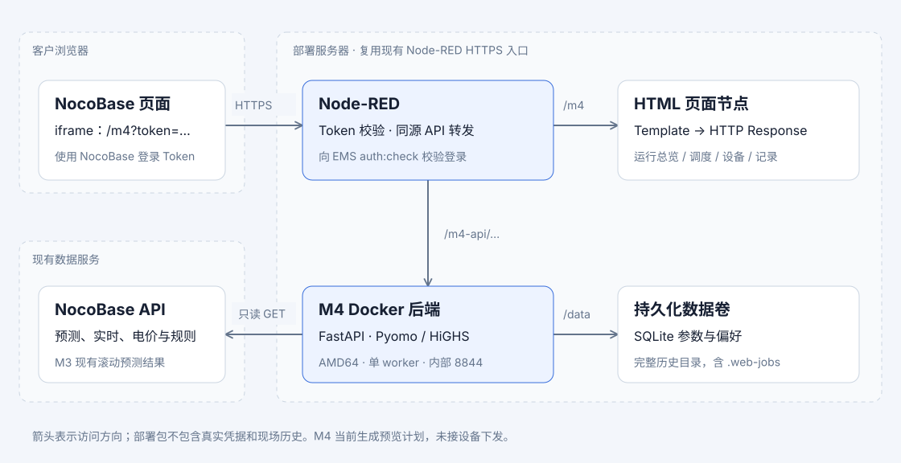

# M4 部署手册

> 当前发布按第4节从工作区构建固定架构标签，默认不生成ZIP、Flow或独立HTML副本；项目隔离配置见[产品化配置与交付](../../产品化配置与交付.md)。首次接入新项目须单独核对站点、网络和网关，不套用旧现场配置。

2026-09-22本地待发布变更：取消自动滚动，改日计划独立写表与凌晨保底；新记录使用“今日有效”。此次涉及网关API逻辑，须同步现有Node-RED的“限定接口与内部转发”函数（`m4/deploy/node_red/prepare_proxy.js`，新增POST `daily-dispatch`白名单）及正式HTML。不要仅替换HTML，否则手动替换入口会404。保留 `-f compose.yaml -f m4-production.override.yaml -f m4-ems-table.override.yaml` 与 `M4_EMS_STATION2_TABLE_WRITES=1`，不可为停滚动而关闭整个日计划自动任务。部署前按项目规则执行专项测试；首次运行会检查本站旧重复记录，已有hold不得自动解除。尚未部署，EMS对“今日有效”的到期执行须联调确认。

版本：2026-09-09 TCP / CCR / NocoBase 登录 Token 版。部署方式：**Node-RED 提供 HTML 并校验 iframe Token，NocoBase 内嵌 URL，Linux AMD64 服务器运行 Docker 后端**。复用现有 Node-RED 的 HTTPS 访问地址，不新增 Nginx。

页面包含日计划预测、计划表状态、设备实测、运行记录和账单统计。已配置电站2计划表写入与回读；不等同于设备控制或物理执行确认。

本版使用 TCP 通信及 Node-RED 内置 HTTP Request 节点。iframe 使用 NocoBase 的 `{{ ctx.token }}`，由 Node-RED 向 EMS `/api/auth:check` 验证登录；不再使用固定 `M4_IFRAME_TOKEN`，不需要 Socket 或 m4Http 配置。

## 1. 部署链路与文件



```text
NocoBase iframe → https://你的Node-RED域名/m4?token={{ ctx.token }}&station=s1
                    ├─ Node-RED → EMS auth:check 校验登录 → 返回 HTML
                    └─ 页面 /m4-api 请求携带 Bearer
                         → Node-RED → EMS 校验登录 → Docker 后端 :8844
                                                    ├─ 持久化参数与历史
                                                    └─ 只读访问 NocoBase 数据
```

页面和 `/m4-api/` 位于同一个 Node-RED 域名，不需要在 HTML 填后端 IP，也不需要 CORS。后端 8844 端口只用于服务器内部访问。

| 交付文件 | 用途 |
|---|---|
| 仓库 `m4/web/M4优化调度控制台-线上版.html` | 唯一正式页面源，粘贴至现有Node-RED Template；发布目录不再附HTML副本 |
| `node_red/m4_customer_flow.json`（仅显式`--include-flow`） | 首次安装或网关变更时生成，包含页面、Token校验和API转发；普通发布不生成 |
| `node_red/env.example` | Node-RED 环境变量填写示例 |
| `node_red/*.js` | Flow 中的 Function 源码，便于维护 |
| `backend/` | Dockerfile、Compose、锁定依赖、启动/检查脚本及后端源码 |
| `secrets/README.txt` | 凭据目录说明，未附真实凭据 |
| `验收记录.md`、`SHA256SUMS` | 已执行检查的范围、交付文件校验和 |

发布脚本在本机构建镜像并推送腾讯云CCR；完整源码只在临时构建目录和镜像内，构建结束清理临时目录。成功后保留部署配置与摘要，生产服务器直接拉取镜像，不执行构建。包不含离线 Docker 镜像 tar、本机配置、参数库或历史记录。按用户要求，本次不做机器上的 Flow 导入验证；以下操作留到具备部署机器后执行。

## 2. 部署前填写的配置

以下域名是填写示例，部署时按实际页面地址修改。Origin 仅含协议、域名和可选端口，末尾不带斜杠或路径。

| 配置 | 示例 | 配置位置 |
|---|---|---|
| M4 页面 Origin | `https://opdash.lvkpower.com` | Node-RED 的 `M4_PUBLIC_ORIGIN` |
| NocoBase 父页面 Origin | `https://ems.lvkpower.com` | Node-RED 的 `M4_FRAME_ORIGIN` |
| NocoBase 当前用户 Token | `{{ ctx.token }}` | 填入 NocoBase iframe URL 的 token 参数 |
| 后端内部地址 | `http://127.0.0.1:8844` | Node-RED 的 `M4_BACKEND_URL` |
| 数据源只读 Token | NocoBase 为后端分配的只读 API Token | `secrets/nocobase_token.txt` |

**两个 Token 用途不同。** iframe 使用 EMS 当前用户的登录 Token；数据源 Token 用于后端从 VIFA 取数。不要把后端数据源 Token 填入 iframe URL。

本包校验 EMS NocoBase 用户登录状态，不再与服务端固定字符串比较。只有 `/api/auth:check` 返回有效用户才放行；401/403、超时、重定向、服务错误或异常响应均不放行。认证响应中的用户信息不会转发到 M4 后端。

当前 M4 仍是两站共享业务入口，已登录 EMS 用户可使用现有两站功能；本次没有增加按用户、角色或电站分权。M4 仍只生成预览，不下发设备指令。[NocoBase 登录校验接口](https://docs.nocobase.com/auth-verification/auth/dev/)

## 3. 上传部署包并准备后端凭据

服务器需要 Linux AMD64、Docker Engine、Docker Compose V2，以及现有 Node-RED。本地构建机需要 Docker buildx、Git、Python 3 及联网下载基础镜像和锁定的 Python 包；服务器需要能拉取 CCR 镜像，后端运行需要访问 `https://vifa.hlszh.com/api/`。

首次安装时将发布目录内的部署配置放到 `/userdata/holo/pyfiles/m4/`，使 backend、node_red 和 secrets 直接位于 m4 下，不要再嵌套一层发布包名。以下命令由部署人员在服务器上执行：

```bash
cd /userdata/holo/pyfiles/m4
sha256sum -c SHA256SUMS
docker version
docker compose version
```

服务器文件结构：

```text
/userdata/holo/pyfiles/m4/
├── backend/                  # Dockerfile、Compose、.env、后端源码
├── node_red/                 # HTML、Flow 和环境示例
├── secrets/
│   ├── nocobase_token.txt     # 后端只读 Token（服务器创建）
│   └── README.txt             # 凭据说明
├── backups/                  # 按需备份
└── 部署手册.md
```

先验证校验和，再填写配置。通过隐藏输入创建后端 Token 文件：

```bash
sudo install -d -m 700 secrets
sudo python3 - <<'PY'
import getpass, os
value = getpass.getpass('NocoBase read-only API token: ').strip()
assert value and not any(c.isspace() for c in value) and '\x00' not in value
fd = os.open('secrets/nocobase_token.txt', os.O_WRONLY | os.O_CREAT | os.O_TRUNC, 0o600)
os.fchmod(fd, 0o600)
with os.fdopen(fd, 'w') as output:
    output.write(value + '\n')
PY
```

Compose 将文件挂载为 `/run/secrets/nocobase_token`。启动脚本读取凭据、初始化数据目录，再以 UID/GID `10001` 运行应用；凭据不写入镜像层。[Docker Compose secrets](https://docs.docker.com/compose/how-tos/use-secrets/)

## 4. 本地构建推送，服务器拉取运行

默认推送腾讯 CCR 仓库 `ccr.ccs.tencentyun.com/taidai-holobase-168/vifa-m4`。环境变量名沿用 `CRR_IMAGE`；腾讯云服务实际名称为 CCR。

### 本地发布

在当前代码仓库 `vifa-en/` 中执行，无需先提交工作区：

```bash
docker login ccr.ccs.tencentyun.com
bash m4/deploy/build-and-push.sh
```

Docker 使用已有登录或凭据助手；脚本不读取或保存登录密码。`CRR_IMAGE` 可更换仓库，`PLATFORM` 默认为 `linux/amd64`，也支持 `linux/arm64`；仅推送固定标签 `0.1.0-<architecture>`。`PYTHON_IMAGE` 指定构建基础镜像，`RELEASE_DIR` 指定尚不存在的交付目录。

脚本按白名单将当前工作区源码（包括未提交修改及新增模块）放入临时目录，再执行本地 `buildx build --load`，核对架构、推送固定标签并检查远端 manifest。完整构建目录在成功、失败或收到 INT/TERM 时自动清理；强制终止进程或断电无法保证清理。默认不生成 ZIP。

成功后，`outputs/m4/releases/0.1.0-<12位提交号>-<时间>-<进程号>/` 仅保留部署配置、Function源码、手册和发布记录，不保留 `backend/app` 源码。`release.json` 记录镜像、Git基线、平台和实际源码摘要；`SOURCE_SHA256SUMS` 留存原构建包清单，`SHA256SUMS` 用于校验保留的交付文件。此目录用于镜像部署，不用于本地源码构建。页面更新使用仓库正式HTML，并核对`release.json`中的`html_sha256`；不生成Template副本或Flow。失败时脚本退出非零，不打印发布成功；已有历史目录及 ZIP 不自动删除。

若首次安装或网关逻辑变更需要完整Flow，独立打包额外传入`--include-flow`。纯HTML改动不传此选项，也不运行`sync_assets.py`。若明确需要独立源码包，使用 `python3 m4/deploy/build_package.py --output <新目录>`；只有额外传入 `--zip` 才生成 ZIP。独立打包命令保留其输出目录，不受发布脚本临时目录清理影响。

### 服务器首次启动

把该次发布包的内容放到 `/userdata/holo/pyfiles/m4`，按第 3 节准备凭据后执行：

```bash
cd /userdata/holo/pyfiles/m4/backend
cp .env.example .env
# 按项目编辑 .env 的 M4_INSTANCE_NAME、M4_BACKEND_ALIAS、配置路径、端口、数据卷和 M4_IMAGE。
# 已有部署保留原实例名和数据卷；新项目使用独立值。M4_IMAGE 必填，否则 compose 会报错退出。
# 私有仓库需要在服务器执行一次 docker login ccr.ccs.tencentyun.com。
M4_COMPOSE_FILES=(-f compose.yaml -f m4-production.override.yaml -f m4-ems-table.override.yaml)
docker compose "${M4_COMPOSE_FILES[@]}" config --images   # 必须先确认回显的是本次发布标签
docker compose "${M4_COMPOSE_FILES[@]}" pull m4-api
docker compose "${M4_COMPOSE_FILES[@]}" up -d --no-build --force-recreate m4-api
docker compose "${M4_COMPOSE_FILES[@]}" exec -T m4-api python -c 'import os; assert os.environ.get("M4_EMS_STATION2_TABLE_WRITES") == "1"'
docker compose "${M4_COMPOSE_FILES[@]}" ps
docker compose "${M4_COMPOSE_FILES[@]}" logs --tail=80 m4-api
```

生产 Compose 不包含 build 配置。`M4_PLATFORM` 默认 `linux/amd64`，按交付镜像选择架构；默认端口绑定 `127.0.0.1:8844`，命名卷 `vifa-m4-data` 挂载到 `/data`。修改宿主端口 `M4_BIND_PORT` 后，宿主机运行的 Node-RED 也要更新 `M4_BACKEND_URL`。脚本只发布镜像和文件，不连接或启动生产服务器。

### 端口与 Node-RED 地址

每个项目独立运行一套 M4，可共用镜像版本。同主机部署多个项目时，分别设置 `M4_INSTANCE_NAME`、`M4_DATA_VOLUME`、`M4_BIND_PORT` 和配置文件路径；共享 Node-RED 网络时，还需分别设置 `M4_BACKEND_ALIAS` 并使用对应地址，例如 `http://factory-a-m4:8844`。不要以共享的服务名 `m4-api` 访问多个实例。下表为兼容已有单项目部署的默认值。Compose 原生 `-p` / `COMPOSE_PROJECT_NAME` 会覆盖文件内实例名称，不应沿用其他项目的值。

| Node-RED 运行方式 | M4_BACKEND_URL |
|---|---|
| 同机宿主机直接运行 | `http://127.0.0.1:8844` |
| Docker 容器，经共享网络访问 | `http://m4-api:8844` |

若宿主机 8844 已占用，在 `backend/.env` 设置 `M4_BIND_PORT=8845` 并执行 `docker compose up -d`。宿主机 Node-RED 改用 `http://127.0.0.1:8845`；共享 Docker 网络里的 Node-RED 仍用 `http://m4-api:8844`，因为容器内部端口固定为 8844。iframe 页面 URL 不随后端端口变化。

保留**一个容器、一个 Uvicorn worker**。候选缓存及求解锁包含进程内状态，当前版本不支持多个 worker 或副本；数据卷应使用本机文件系统，不使用 NFS 共享运行目录。

有机器后可运行本地检查：

```bash
docker compose exec -T m4-api python /opt/m4-runtime/preflight.py
docker compose exec -T m4-api python /opt/m4-runtime/healthcheck.py
```

`preflight.py` 检查依赖、HiGHS 可用性、数据目录权限及最近任务标记；退出码 0 表示通过，1 表示检查失败，2 表示最近任务仍标记 running、不宜停机更新。健康检查只读取本地参数库，不访问数据源或启动求解。healthy 不代表真实输入已就绪。

## 5. Node-RED 登录校验与默认地址

新 Flow 已在页签属性的“环境变量”中提供以下默认值，无需设置固定访问 Token 或创建 `secrets/node-red.env`：

| 变量 | 默认值 | 用途 |
|---|---|---|
| `M4_PUBLIC_ORIGIN` | `https://opdash.lvkpower.com` | M4 页面 Origin，检查浏览器写请求 |
| `M4_FRAME_ORIGIN` | `https://ems.lvkpower.com` | NocoBase 父页面 Origin，同时作为登录校验服务地址 |
| `M4_BACKEND_URL` | `http://127.0.0.1:8844` | Node-RED 访问 M4 后端的地址 |

域名或端口不同，直接在导入 Flow 的页签属性里修改这三项，不把真实登录 Token 填入 Flow。页签变量优先于同名进程环境变量，已有环境配置不同的部署需保留原实际地址。Node-RED 与 EMS 之间需要能通过 HTTPS 访问 `/api/auth:check`；校验地址来自页签配置，不接收浏览器指定的 URL，不跟随重定向。

如果 Node-RED 在 Docker 容器中，`127.0.0.1` 指向 Node-RED 自己。保持现有共享网络配置，将页签中的 `M4_BACKEND_URL` 改为 `http://m4-api:8844`。后端默认网络名 `vifa-m4_default`，现有 Node-RED 可在原 Compose 中合并：

```yaml
services:
  node-red:                       # 替换为现有服务名；保留已有设置
    networks:
      - default
      - m4-network
networks:
  m4-network:
    external: true
    name: vifa-m4_default
```

只使用 `{{ ctx.token }}` 但仍导入旧版固定 Token Flow，会出现“M4 访问配置尚未完成”或“凭据无效”。需要更新为本版完整 Flow，单独替换 HTML 无法改变服务端校验逻辑。

## 6. 将 HTML 和 API 路由放入 Node-RED

首次安装或网关逻辑变更时，用`python3 m4/deploy/build_package.py --output <新目录> --include-flow`显式生成配套Flow，再在现有Node-RED导入该目录的`node_red/m4_customer_flow.json`并Deploy。它使用内置 HTTP In、Function、Template、HTTP Request、HTTP Response 和 Catch 节点，不要求额外安装节点包。

页面链路是 `GET /m4 → 取 query Token → EMS 登录校验 → Template → HTTP Response`；API 链路是 `GET/PUT/POST /m4-api/... → 取 Bearer → EMS 登录校验 → 恢复原请求 → 限定接口 → 后端 HTTP Request → HTTP Response`。完整 Flow 已嵌入同一份 HTML，不需要再额外粘贴一次。

如果只更新页面，仅修改仓库`m4/web/M4优化调度控制台-线上版.html`，将其全文替换到既有Template节点；不更新Flow JSON或生成其他HTML：

| Template 配置 | 值 |
|---|---|
| 属性 | `msg.payload` |
| 模板语法 | Plain text / 纯文本 |
| 编辑器格式 | HTML |
| 输出 | String / 字符串 |
| HTTP Response | 200、`Content-Type: text/html; charset=utf-8` |

不要只创建三个页面节点而遗漏 Token/API 节点；单独放入 HTML 无法提供后端转发。不要使用 Dashboard 的 `ui_template` 代替 HTTP Template，也不要重复导入造成同一个 `/m4` 多条路由。[Node-RED HTTP 页面示例](https://cookbook.nodered.org/http/create-an-http-endpoint)、[Template 节点](https://nodered.org/docs/user-guide/nodes#template)

正式外部路径应同时为 `/m4` 和 `/m4-api/...`。HTML 的 API 路径从域名根开始；若现有 `httpNodeRoot` 或入口将路由放在 `/tools/` 等前缀下，需要按现有入口配置将这两组路径一致映射，不能只让 `/tools/m4` 可访问而遗漏根路径 API。

Node-RED 只转发规定的两站接口，不接收浏览器指定的后端地址。校验通过后，它清除浏览器的 Token/Cookie/Origin，并为本地后端设置固定 Host，以适配后端现有本地访问约束。保持这些 Function 完整，后端端口继续只供内部访问。

## 7. NocoBase 配置 iframe URL

在 NocoBase 的 iframe 区块填写：

```text
https://opdash.lvkpower.com/m4?token={{ ctx.token }}&station=s1
```

`station=s1` 为电站 1，`station=s2` 为电站 2；页面仍可切换电站。域名对应第 5 节配置；`{{ ctx.token }}` 保留在 NocoBase 的 iframe URL 设置中，由 NocoBase 渲染为当前用户 Token，不是固定密码。普通浏览器地址栏不会替换该表达式；如果实际请求仍含大括号，应检查 NocoBase 的变量渲染。普通 iframe 区块使用 URL 即可；若手写 HTML 属性，参数间的 `&` 写为 `&amp;`。不要添加演示/离线模式参数。[NocoBase iframe 区块](https://docs.nocobase.com/integration/block-iframe/)

HTML 从 URL 读取 Token，仅保存在页面内存中；API 请求通过 `Authorization: Bearer …` 发送，API URL 不附 Token。页面设置 `no-referrer`，避免通过 Referer 传递带凭据 URL；URL 保留 Token 以支持刷新。部署入口的访问日志仍须避免记录完整 Token 查询参数，分享页面地址也会同时分享访问权限。

继续使用现有 HTTPS 页面入口，不新增 Nginx。若 Node-RED 目前仅有裸 HTTP，需要先为现有入口启用 HTTPS；Node-RED 本身也可通过 `settings.js` 的 `https` 配置加载证书。HTTPS 同时避免 NocoBase 混合内容拦截，并满足页面生成请求标识使用的安全上下文要求。[Node-RED 运行时配置](https://nodered.org/docs/user-guide/runtime/configuration)

Flow 返回 `Content-Security-Policy: frame-ancestors 'self' <M4_FRAME_ORIGIN>`。现有入口不能再叠加禁止该父域的 `X-Frame-Options` 或更严格 CSP；NocoBase 父页面的 `frame-src` 也需允许 M4 域。若配置 iframe sandbox，至少保留页面所需的 `allow-scripts allow-same-origin`；产生 `null` Origin 会导致保存被拒绝。[frame-ancestors](https://developer.mozilla.org/en-US/docs/Web/HTTP/Reference/Headers/Content-Security-Policy/frame-ancestors)

登录过期后重新登录 NocoBase 并重新打开 iframe，使 URL 注入新的 Token；无需修改 Node-RED。若现有 Node-RED 还有 `httpNodeAuth` 等额外认证，需沿用现有接入方式解决兼容，不应直接移除原有保护。

## 8. 第一次使用与业务范围

进入页面后，按电站保存调度参数及运营偏好，再查看“设备与数据”中的输入状态。数据未就绪时按页面原因处理，不通过关闭校验绕过。

“刷新计划”读取已有记录；刷新输入会读取上游；“生成调度计划”启动新的预览计算。正式运行前需确认真实参数、数据权限和输入时效；本次材料准备不自动触发这一步。

当前后端数据源固定为 `https://vifa.hlszh.com/api/`，没有通过 `.env` 修改数据源域名的选项。换 NocoBase 实例需要修改并验证 `m4/settings/upstream.py`、`control_sources.py` 的来源白名单，不能只换 Token。

| M4 电站 | 上游编号 | 柜 |
|---|---|---|
| station-1 / s1 | ES01 | emu11、emu12 |
| station-2 / s2 | ES02 | emu21–emu26 |

后端只读 Token 涉及：`t_need`、`re_flow`、`t_model`、`t_emu`、`t_es_data`、`t_peak_diy`、`t_rate`、`energy_forecast_latest`、`energy_forecast_manual_runs`、`energy_forecast_manual_points`。

负荷读取 M3 已有滚动预测，不触发 M3 任务；保留现有手动预测补缺兼容。预测窗口需连续 95 或 96 点，只允许裁去末尾缺失的一格。SOC、告警、采样时效和逐柜参与规则沿用当前实现。此前上游存在间歇读取失败，本部署包没有修复该问题，也没有新增自动刷新或自动调度。

## 9. 持久化、迁移与备份

数据卷中需要保留：

```text
/data/settings.sqlite3            # 调度参数和运营偏好
/data/settings.sqlite3-*          # 如存在，SQLite 辅助文件
/data/solver-decisions/           # 完整历史，包含隐藏 .web-jobs 和锁文件
```

旧服务默认数据位于 `runtime/m4/`；如配置过环境变量，以实际路径为准。迁移前确认两站没有 running 任务，再停止旧服务，将参数库和整个历史目录迁到新卷，保持目录结构；不要在写入期间直接复制 SQLite，或遗漏隐藏文件。

以下备份示例在 `backend/` 目录执行。先将镜像与卷名改为 `.env` 的实际值，并通过页面或 `preflight.py` 确认没有运行中任务：

```bash
docker compose stop m4-api
mkdir -p ../backups
M4_BACKUP_FILE="../backups/m4-data-$(date +%Y%m%dT%H%M%S).tar.gz"
docker run --rm --platform linux/amd64 --network none --read-only \
  --user 10001:10001 --entrypoint python \
  -v vifa-m4-data:/data:ro "${M4_IMAGE:?使用现场实际镜像引用}" \
  -c 'import sys,tarfile; a=tarfile.open(fileobj=sys.stdout.buffer,mode="w|gz"); a.add("/data",arcname="data"); a.close()' > "$M4_BACKUP_FILE"
# 确认上一步退出码为0，再检查归档并启动服务。
tar -tzf "$M4_BACKUP_FILE"
docker compose -f compose.yaml -f m4-production.override.yaml -f m4-ems-table.override.yaml up -d m4-api
```

备份辅助容器不挂载凭据；归档由宿主 shell 写入，避免容器受限权限导致备份目录不可写。Token 文件另按服务器凭据策略保存。不要执行 `docker compose down -v`，它会删除数据卷。

恢复时只使用可信备份，先创建新命名卷，在独立辅助容器中还原完整 `data/` 内容，并将新卷内数据归属设为 `10001:10001`。校验恢复内容后，把 `.env` 的 `M4_DATA_VOLUME` 指向新卷，再启动并检查参数、偏好、历史。保留原卷作为回退，不覆盖当前卷。入口脚本只初始化顶层目录，不会递归修复迁入文件的所有权；本次没有进行现场恢复演练。

## 10. 更新、回滚与离线导出

- 更新HTML：用仓库正式HTML替换原Template内容并Deploy，不生成Flow或HTML副本。首次引入新接口或网关逻辑确有变化时，单独更新相应Function／Flow。
- 更新后端：获准发布后运行`bash m4/deploy/build-and-push.sh`，固定标签`0.1.0-<architecture>`。生产沿用已有配置、Token和数据卷；镜像及内容摘要取本次发布记录，使用脚本输出的三份Compose更新命令。无需先提交，但发布内容须明确。
- 固定标签会被覆盖，不能当作历史回滚标签；只有实际保留且核实兼容的旧镜像ID／摘要才可用于回退。数据格式变化须单独评估，不能假定旧代码能读取新记录。

生产更新直接使用发布脚本打印的完整命令，避免此处维护第二套命令。电站2联调需三份Compose覆盖、健康检查、写表开关与内容摘要核对；只有检查完成才按脚本非强制清理刚替换的旧镜像。

容器停止可能中断后台任务，发布前确认任务状态。服务器无法访问CCR时才另行准备经过核对的镜像导出方案，普通交付不需要ZIP或镜像tar。`验收记录.md`仅保存历史验证，不作为当前版本已通过证明。

## 11. 常见问题

| 现象 | 检查项 |
|---|---|
| 页面 401 | `{{ ctx.token }}` 是否被 NocoBase 替换成真实 Token；是否已过期；Token 是否由所配置 EMS 实例签发 |
| 页面/API 503，提示访问配置未完成 | 是否仍是旧版固定 Token Flow；新版页签的两个 HTTPS Origin 是否有效 |
| 页面/API 503，提示登录校验不可用 | Node-RED 是否能连接 EMS `/api/auth:check`；EMS 是否返回重定向、错误或异常数据 |
| 页面正常、API 404 | 是否遗漏完整 API Flow；外部 `/m4-api/` 是否可到达 Node-RED；是否只配置了带前缀页面路径 |
| API 502 | 后端是否运行、内部地址/端口是否正确；Node-RED 容器是否已加入后端网络 |
| API 400 Invalid host | 转发 Function 的固定 Host 是否被修改 |
| 保存 403 | `M4_PUBLIC_ORIGIN` 是否为 M4 自己的 HTTPS Origin；是否误填 NocoBase 父域或 sandbox 造成 null Origin |
| iframe 被拒绝 | HTTPS、父/子页面 CSP、X-Frame-Options、现有入口额外响应头 |
| healthy 但无输入 | 数据源 Token、表权限、DNS/证书、95/96 点覆盖、柜状态与采样时效 |
| 重启后参数/记录为空 | 数据卷名/挂载路径是否改变；历史迁移是否遗漏 |
| Permission denied | 数据目录及迁移文件所有权是否为 10001:10001 |

需要独立源码检查包时，在`vifa-en/`内执行（普通镜像发布无需这一步）：

```bash
python3 m4/deploy/build_package.py --output /path/to/new/m4-deployment-20260909
```

输出目录必须不存在。生成脚本按白名单复制后端源码及运行必需的正式HTML，附配置、手册和校验清单，不附现场凭据和运行数据。不生成独立HTML副本；Flow和ZIP分别需要显式`--include-flow`、`--zip`。

正式发布以工作区白名单构建的镜像、`release.json`和内容摘要为准，HTML使用对应正式源码；仅有网关变更时另行更新Flow。此前固定 `620ef58` 的 TCP/Socket 示例包不包含后续账单功能；不要混用旧包 HTML 与新接口。手动执行 `build_package.py` 只生成文件，不构建或推送镜像。


## 账单统计更新提示

账单统计需要同时发布当前 HTML、后端 `m4.settings` 包和包含 `bills` GET 白名单的 Node-RED Flow。更新后端后重启服务。查询为 `/m4-api/stations/{station_id}/bills?month=YYYY-MM`，上游 Token 需具有 `t_es_stat:list`、`t_es_count_stat:list` 只读权限。详细字段及日月差额口径见源码 `docs/m4/账单统计说明.md`；该功能不写统计表、不触发求解或设备下发。旧发布包不会随源码编辑自动更新。

## 移除柜级分配（2026-09-12）

M4 仅输出站级功率计划，由 EMS 负责柜间分配。升级时需发布包含本次移除的后端镜像，并同步 Node-RED「限定接口与内部转发」函数与最新 HTML。只替换页面不会关闭旧后端接口。

柜级分配算法、保存/查询 API、页面预览和历史入口已移除；网关不再允许 allocations / allocation-result。旧的分配专用镜像覆盖文件已从源码移除，现有部署须在发布新镜像时更新实际镜像引用，不能继续追加旧分配版本覆盖。

/data/cabinet-allocations 中的既有历史文件保留，无需迁移或删除；站级计划、决策历史及原 /data 持久化挂载继续保留。此变更不新增真实设备下发入口，不改变站级优化及 EMS 设备准入规则。本次源码修改不代表线上已经升级。

### 生产覆盖文件（2026-09-14 合并为单份）

线上502通过容器检查定位：M4仅在vifa-m4_default，Node-RED在1panel-network，没有共同网络。现由 `backend/m4-production.override.yaml` 一次性提供：`default` 与外部 `1panel-network`（别名 `m4-api`）、M3 管理 Token 与 Worker run 目录的只读挂载，并保留原 `/data` 数据卷。Node-RED 后端地址使用 `http://m4-api:8844`。

同文件把镜像声明为 `image: ${M4_IMAGE:?…}`，**不再写死标签或摘要**；`M4_IMAGE` 缺失时 Compose 直接报错退出。启动时只需两段：

```bash
cd /userdata/holo/pyfiles/m4/backend
docker compose -f compose.yaml -f m4-production.override.yaml -f m4-ems-table.override.yaml up -d --no-build --force-recreate m4-api
```

旧的 `m4-pv`、`m4-m3-mape`、`m4-station-power` 覆盖文件已移除，其内容全部并入本文件；退役的 `m4-late-peak-reserve`、`m4-parallel-inputs`、`m4-cabinet-allocation`、`m4-pv-readonly` 曾各自写死旧镜像摘要，**加入启动列表会把镜像拽回旧版**，须从服务器 backend 目录移出（先移到备份目录，不要直接删除）。

现有容器可用 `docker network connect --alias m4-api 1panel-network <容器名>` 临时恢复连接，重建持久性依赖上述 Compose 配置。需从 nodered 容器访问 settings 返回 200 并回查公开 API 后确认恢复。
