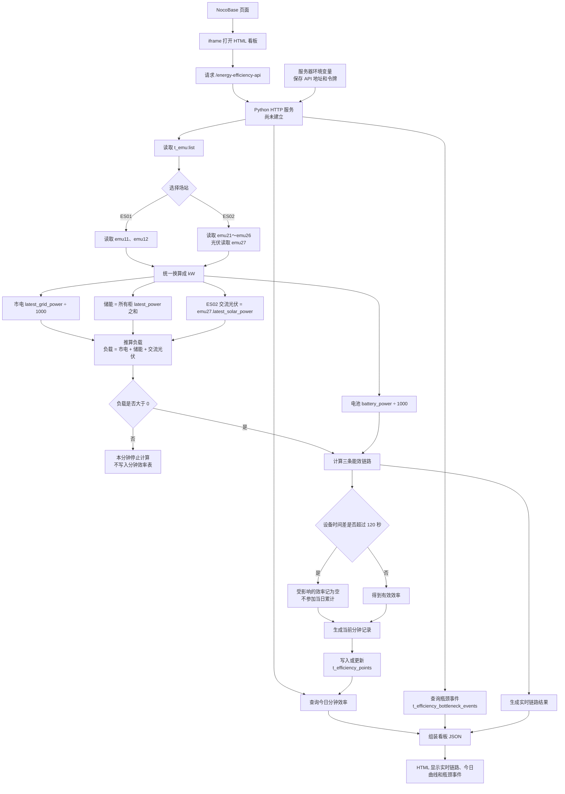
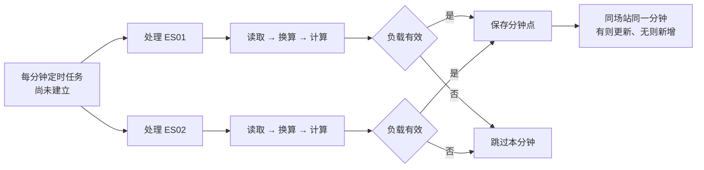
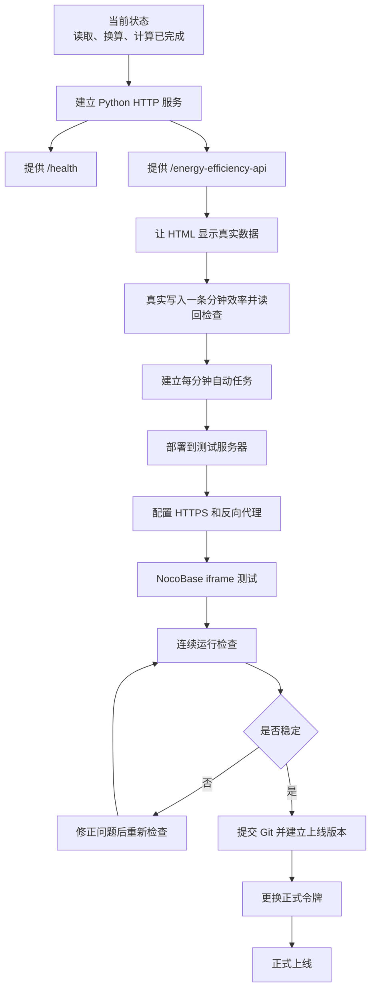

# M2 线上部署流程图

更新日期：2026-08-26

## 1. 上线后的数据流程

## 2. 每分钟自动保存流程

## 3. 从现在到正式上线

## 4. 上线前必须确认

- Python 服务重启后能自动恢复运行。
- API 令牌只放在服务器环境变量中，不写入 Python、HTML、Git 或网址。
- iframe 不直接接触 `t_emu` 的令牌。
- 真实测试完成“读取 `t_emu` → 计算 → 写入分钟表 → 读回 → HTML 显示”。
- 同一分钟重复执行不会产生两条数据。
- 负载小于或等于 0 时跳过，不强行写成 0。
- ES02 的设备时间差在 120 秒以内时可以正常计算。
- 上线前提交 Git，保留可以回滚的版本。
