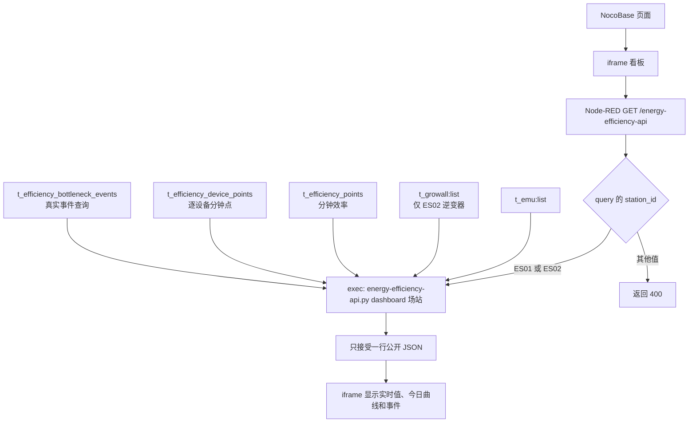
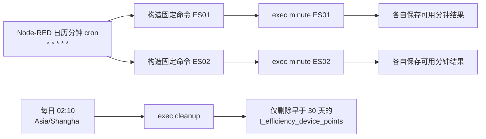
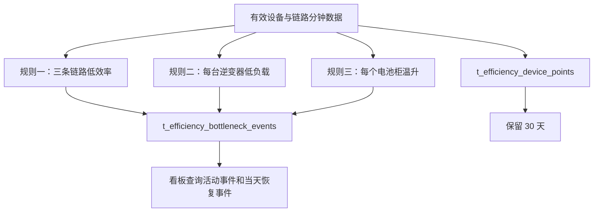

# M2 线上部署流程图

更新日期：2026-08-27

这份说明只描述要上传和启用的服务器流程。仓库里的 flow 已完成本地 JSON 和自动测试验证，但**尚未导入任何真实 Node-RED，也没有执行过生产分钟写入**。

## 1. 实际运行方式

Node-RED 是唯一对 iframe 开放的入口；不需要另起 Python HTTP 服务。服务器和 Node-RED 的时区必须都是 `Asia/Shanghai`。这样每天 02:10 的清理时间、页面当天范围和分钟桶才会一致。



`station_id` 仍由 URL query 读取；只允许 `ES01` 和 `ES02`，不是把 ES02 写死。Node-RED 不把令牌放进 flow，也不把脚本的原始 stdout/stderr 返回 HTTP 或直接写进调试栏：它只接受并记录最小的脱敏 JSON 摘要。

## 2. 定时任务和数据规则



两条分钟命令彼此独立：ES01 失败不会阻止 ES02，反之亦然。每次分钟处理读取 `t_emu`；ES02 还读取 `t_growall` 的 9 台逆变器。设备采样晚于计算时刻或超过 2 分钟时不参与该分钟。



三条规则是独立的：任意一条满足都可以产生事件，不需要同时满足。每日清理只动逐设备表 `t_efficiency_device_points`；不会删除 `t_efficiency_points` 或 `t_efficiency_bottleneck_events`。

## 3. 服务器要准备和上传的文件

在服务器创建目录，例如 `/userdata/holo/pyfiles/`。从同一个已测试版本上传：

- `energy-efficiency-api.py`；
- 整个 `m2/` Python 包（至少包含 `__init__.py`、`station_energy_data_adapter.py`、`station_energy_backend.py`、`station_efficiency_device_adapter.py`、`station_efficiency_history.py`、`station_efficiency_job.py`、`station_efficiency_nocobase.py` 和 `station_efficiency_bottlenecks.py`）；
- `m2/node-red-energy-efficiency-api-flow.json`，用于 Node-RED 导入；
- 如同一服务器托管看板，再上传 `m2/场站三条能效链路能流图.html`。

还要在 `energy-efficiency-api.py` 同目录创建**不上传 Git**的 `energy_efficiency_local_config.py`。可用环境变量替代其中任一敏感值；二者不要同时写两套不同令牌。

本地配置键如下（填真实值时不要贴到工单、flow 或文档）：

```python
EMU_URL = ""
EMU_TOKEN = ""
NOCOBASE_BASE_URL = ""
NOCOBASE_TOKEN = ""
TIMEZONE = "Asia/Shanghai"
REQUEST_TIMEOUT_SECONDS = 15
GROWALL_URL = ""
GROWALL_TOKEN = ""
PV_INVERTER_SNS_BY_STATION = {"ES02": ("emu1", "emu2", "emu3", "emu4", "emu5", "emu21", "emu22", "emu23", "emu24")}
PV_INVERTER_RATED_POWER_KW = 60
DEVICE_SAMPLE_MAX_AGE_MINUTES = 2
DEVICE_POINT_RETENTION_DAYS = 30
BATTERY_MAX_TEMPERATURE_FIELD = ""
BATTERY_HOT_CLUSTER_FIELD = ""
BOTTLENECK_RULES = {}
```

`BATTERY_MAX_TEMPERATURE_FIELD` 和 `BATTERY_HOT_CLUSTER_FIELD` 暂时可留空；这会跳过温升判断，不会把缺失温度当成 0。环境变量名称见程序：`VIFA_EMU_URL`、`VIFA_EMU_TOKEN`、`M2_NOCOBASE_BASE_URL`、`M2_NOCOBASE_TOKEN`、`M2_TIMEZONE`、`M2_REQUEST_TIMEOUT_SECONDS`、`VIFA_GROWALL_URL`/`M2_GROWALL_URL`、`VIFA_GROWALL_TOKEN`/`M2_GROWALL_TOKEN`，以及各 `M2_*` 数值项。

## 4. 导入和启用 flow

1. 先在 Node-RED 菜单导出当前 flow，保存为“启用前备份”。
2. 确认 Node-RED 进程时区是 `Asia/Shanghai`，并确认它能读取 `/userdata/holo/pyfiles/energy-efficiency-api.py` 及同目录配置。
3. 菜单选择“导入”，导入 `node-red-energy-efficiency-api-flow.json`，检查组“能效分析API”内有看板、每分钟和每日清理三段。
4. 确认 HTTP 节点路径仍是 `GET /energy-efficiency-api`；不修改为 ES02，也不在 exec 命令后追加 token。
5. 初次部署时先不要启用或手工点击“每分钟触发”和“每日清理30天前设备点”。先做下面的只读检查。

## 5. 先做只读和看板验证

在服务器目录手工执行，只读且每次都应只输出一行 JSON：

```bash
python3 energy-efficiency-api.py dashboard ES01
python3 energy-efficiency-api.py dashboard ES02
```

检查两条命令都没有输出 token、密码或完整授权头。然后访问：

```text
/energy-efficiency-api?station_id=ES01
/energy-efficiency-api?station_id=ES02
```

应能分别显示对应场站；`station_id=ES03` 应返回 400。此阶段不触发 `minute` 或 `cleanup`，所以不会写入或删除数据。

## 6. 分钟写入验证的安全停点

只有在测试环境、数据表和权限已由现场人员确认后，才可手工点击一次“每分钟触发”。它会真的分别执行 ES01、ES02 写入。验证每个场站各有一个对应分钟桶的 `t_efficiency_points`，并只对有有效采样的设备写入 `t_efficiency_device_points`；重复同一分钟不应产生重复行。

**安全停点：** 两个场站各完成一次确认后立即停止，不要启用自动 cron；不要点击每日清理；不要在未获得生产写入许可时继续。记录结果、报错的脱敏摘要和表中行数后，交由现场负责人决定是否继续。每日清理只应在已确认设备点历史超过 30 天、且已备份/审批后再单独手工验证。

## 7. 启用、观察和回滚

得到明确许可后再部署启用：先观察一个完整分钟边界，确认 ES01 和 ES02 的脱敏结果各自出现；再在第二天 02:10 后检查清理结果。任何一站失败时，另一站仍应继续运行。

需要回滚时：

1. 立即禁用或移除本组的分钟和每日 inject 节点并部署，先停止后续写入/清理；
2. 导入第 4 节保存的“启用前备份”并部署；
3. 恢复同一份已测试的 Python 文件和本地配置备份；
4. 保留 Node-RED 的脱敏错误摘要和时间，不要复制原始 stderr 或凭据到问题单。

回滚不会自动删除已经写入的分钟点、设备点或事件；是否清理已有测试记录必须由有数据权限的现场人员单独决定。
