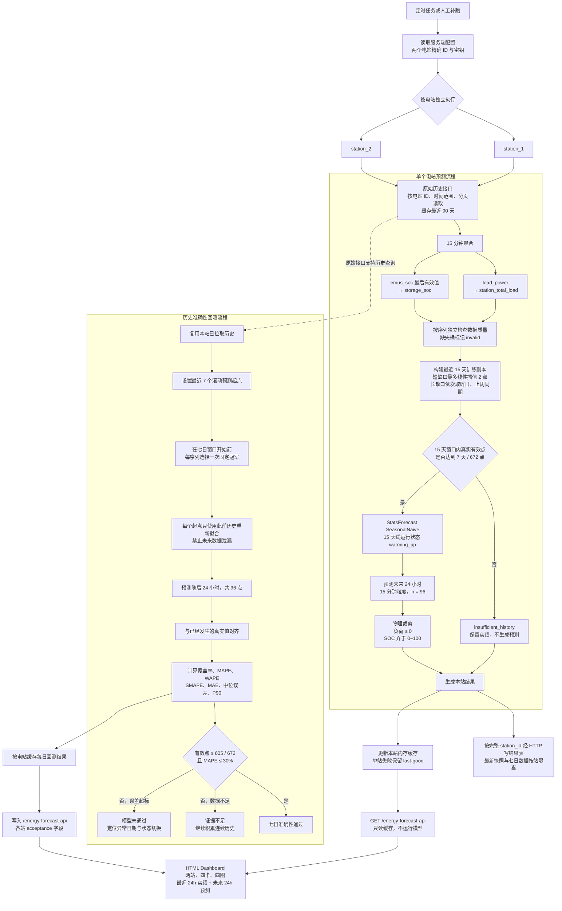

# M3 双电站预测与历史回测流程

日期：2026-08-27  
适用范围：当前双电站、双序列 StatsForecast 实现

## 接口职责边界

- 原始接口支持按电站、时间范围和分页读取历史数据。
- `/energy-forecast-api` 只读取预测缓存，展示最近 24 小时实绩、未来 24 小时预测和各站每日缓存的七日回测汇总，不提供完整历史查询。
- 历史回测由后台刷新任务执行，同一电站同一自然日只计算一次；浏览器 GET 不运行模型，也不再新增 `/energy-forecast-backtest-api`。
- 完整电站 ID 和 Token 仅允许存在于服务端配置与内部 HTTP 请求中，不得进入浏览器响应、HTML 或日志。

## 当前 15 天训练规则

- Worker 仍按分片拉取并缓存最近 90 天，便于后续回测和扩大训练窗口；每次在线预测与当前模型选择只使用截至预测时点的最近 15 天。
- 1～2 个连续缺失桶只在训练副本中做时间线性插值；更长缺口先取昨日同一 15 分钟时刻，昨日也无效时再取上周同一时刻。填充值不写回原始缓存，也不写入 NocoBase 原始数据。
- 7 天门槛只统计未经填补的真实有效点；季节性填补不能把不足 7 天的站点变成可预测状态。仍无法填补的缺口按最后一个未解决缺口之后的可用尾段训练。
- 15 天窗口不满足 28 天完整选模门槛，因此当前固定使用 StatsForecast `SeasonalNaive` 并标记 `warming_up`。原有 28 天以上的 AutoETS、AutoARIMA、MSTL 交叉验证能力仍保留在通用训练路径中，当前在线试运行不触发。

## 准确性判断

- 数据是否足够：检查连续有效训练天数、回测成功天数和有效点覆盖率。
- 模型是否准确：检查 MAPE、WAPE、SMAPE、MAE、中位 APE 和 P90 APE。
- 当前正式门槛：连续 7 天共 672 点，至少 605 个有效非零实绩点，且 MAPE 不超过 30%。
- 数据不足和模型未通过必须分别展示，不能将 `insufficient_history` 误报为模型预测失败。
- 当前没有停机、检修、SOC 策略切换或传感器异常日期清单，因此不做业务事件剔除；所有质量为 `valid` 且能与预测对齐的实绩均计入回测。零实绩单独计数，不进入 MAPE 分母。
