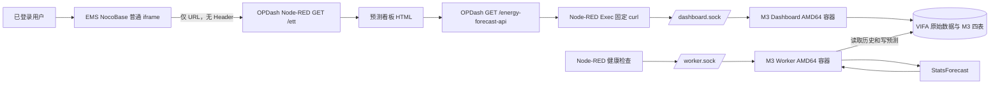
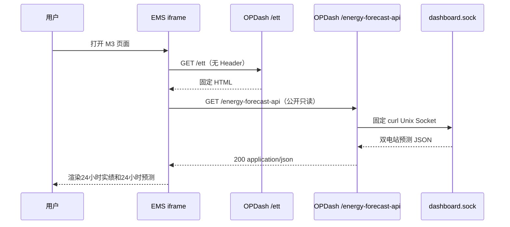
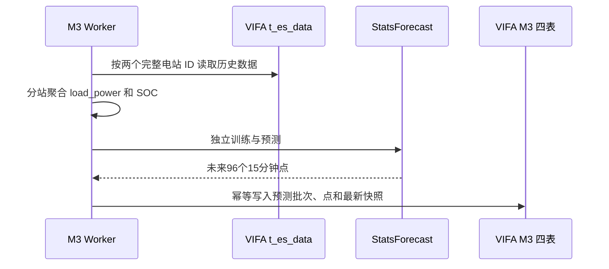

# M3 AMD64 三域部署架构流程图

## 组件图

```mermaid
flowchart LR
    U[已登录用户] --> N[EMS NocoBase 普通 iframe]
    N -->|仅 URL，无 Header| E[OPDash Node-RED GET /ett]
    E --> H[预测看板 HTML]
    H --> A[OPDash GET /energy-forecast-api]
    A --> X[Node-RED Exec 固定 curl]
    X --> DS[/dashboard.sock/]
    DS --> D[M3 Dashboard AMD64 容器]
    D --> V[(VIFA 原始数据与 M3 四表)]

    W[M3 Worker AMD64 容器] -->|读取历史和写预测| V
    W --> S[StatsForecast]
    S --> W

    NR[Node-RED 健康检查] --> WS[/worker.sock/]
    WS --> W
```

## 页面时序

```mermaid
sequenceDiagram
    participant U as 用户
    participant N as EMS iframe
    participant E as OPDash /ett
    participant A as OPDash /energy-forecast-api
    participant D as dashboard.sock

    U->>N: 打开 M3 页面
    N->>E: GET /ett（无 Header）
    E-->>N: 固定 HTML
    N->>A: GET /energy-forecast-api（公开只读）
    A->>D: 固定 curl Unix Socket
    D-->>A: 双电站预测 JSON
    A-->>N: 200 application/json
    N-->>U: 渲染24小时实绩和24小时预测
```

## Worker 时序

```mermaid
sequenceDiagram
    participant W as M3 Worker
    participant R as VIFA t_es_data
    participant S as StatsForecast
    participant T as VIFA M3 四表

    W->>R: 按两个完整电站 ID 读取历史数据
    W->>W: 分站聚合 load_power 和 SOC
    W->>S: 独立训练与预测
    S-->>W: 未来96个15分钟点
    W->>T: 幂等写入预测批次、点和最新快照
```

## 失败边界

- OPDash 地址可访问时无需用户认证；
- Dashboard Socket 不可用：返回 502；
- 单站历史不足：只影响该站；
- iframe 只配置 URL，不使用 Header 或 URL Token。
