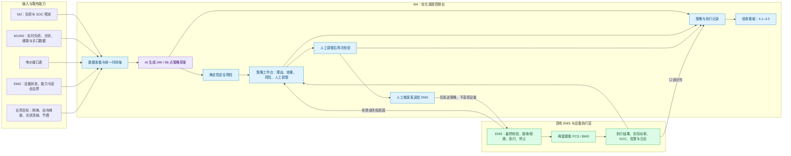

# M4 需求：Grill / Discovery Notes
Date: 2026-09-03 · Goal: 系统提取并收敛 M4 的业务目标、范围、流程、数据、策略、安全、验收与交付要求

## Summary / key decisions

- 访谈已于 Q22 暂停；当前阶段先使用下方骨架图校准 M4 框架，未决项保留，不进入实现细节。
- 已将本轮已确认框架毕业为 `M4优化调度控制台概要设计.md`，并制作 `M4优化调度控制台.html` 静态交互原型，供跨团队沟通；未决项仍以本文件的 Open flags 为准。
- M4 首版不做全自动闭环；系统自动生成策略草案，不设置正式审批流程。操作员可以人工调整充放电时段、功率和 SOC 上下限，调整后点击一次“下发执行”；未显式下发时不控制设备。
- 每份策略覆盖未来 24 小时，采用 15 分钟粒度，共 96 个时点；两套储能分别输出目标充放电功率和目标 SOC 区间，并与 M3 预测时间轴对齐。
- M3 不新增光伏预测。M4 使用两组光伏实时功率与历史曲线，以最近 7 个有效同类日同时间点中位数生成保守的 96 点“调度参考基线”，并用最新实时光伏修正尚未执行的建议；该基线不作为 M3 预测，也不纳入 M3 准确率验收。
- 实时实现“光伏余电给储能充电”本身不依赖光伏预测，可由当前光伏功率减当前负载得到余电；光伏参考基线用于提前预留储能容量、安排谷充/峰放和减少不必要循环。
- 实际光伏与参考基线偏差较大时，首版每 15 分钟重新计算并产生调整建议，但不得自动覆盖已下发计划；操作员查看后点击“重新下发”才改变设备计划。
- 峰/平/谷/尖峰及需量电价由外部接口表提供，M4 通过接口读取，不在代码中写死；策略记录需关联当次使用的电价数据版本或快照。
- M4 调度策略由 AI 模型优先生成；AI 只负责输出策略，不参与设备执行。AI 原始输出与人工修改结果均须经过同一确定性安全校验，只有合法策略才可进入下发流程；设备执行层完全不调用 AI。
- 本轮拷打的当前目标是先梳理 M4 的产品与系统框架，而非提前决定模型厂商、接口字段、算法参数等实现细节；实现细节统一作为后续设计项。
- 顶层框架包含数据准备、AI 策略生成、安全校验、人工调整、人工下发、轻量执行结果回读和验收举证。
- M4 不重复建设成熟的设备实时监控、曲线和告警系统；只从现有 EMS/PCS 读取下发结果、实际功率、SOC、设备告警与执行日志，用于操作反馈和验收证据。
- M4 的产品定位是“优化调度控制台”，用户侧分为策略工作台、策略与执行记录、验收看板三个区域；它不是新的综合能源监控平台。
- M4 的首要用户为能源管理人员，现场运维负责查看执行与必要时切回现场控制，管理层/验收人员只读查看结果；首版只区分可操作与只读权限。
- 现场已有一套 EMS 负责设备控制，最终链路确定为：AI 在 M4 生成策略 → M4 安全校验与人工调整 → 操作员触发发送给 EMS → EMS 执行 → M4 读取 EMS 执行记录。EMS 是唯一设备执行者，M4 不直接连接或控制 PCS。
- EMS 拒绝、执行失败或部分执行时，M4 展示状态与原因，不自动修改或重发；操作员调整、重新校验后再次发送。已进入执行的计划由 EMS 负责暂停、终止和现场切换，M4 只读回执行状态并串联版本证据。
- AI 策略输入框架确认为五类：M3 预测数据、实时能源数据、电价成本数据、EMS 设备能力与状态、业务目标和调度边界。天气、生产计划和复杂光伏预测不是首版必需输入。
- AI 策略输出框架确认为四类：未来 24 小时的 96 点调度计划、逐时段决策理由、购电/需量/光伏消纳/节费效果预估、数据与设备风险提示。AI 输出是可解释策略草案，不是设备指令。
- 联调与验收时仅对书面授权的设备、时段、功率和 SOC 范围开放策略下发；现场人工操作、急停和设备保护优先。
- 首版策略对象仅为两套储能 PCS，策略包含充放电功率、运行模式和计划曲线，并由 EMS 负责实际执行；光伏、厂区负载、市电及关口计量均只读。
- 光伏直供/余电存储和需量削峰通过储能功率调度实现；首版不主动控制光伏逆变器、不切除生产负载，也不远程启停设备或复位故障。
- 首版的主要目的为通过验收文档，产品范围和证据设计优先逐项覆盖附件 1 的 M4 4.1–4.5 及核心指标 K4，不以追求算法复杂度为目的。
- 优化优先级为：安全/人工指令/设备保护 > 关键时段 SOC 储备和供电可靠性 > 月度最大需量控制 > 峰谷套利降电度电费 > 提高光伏自用率 > 减少无收益循环与电池损耗。
- 已有 M3 明确不包含 M4 调度决策；M3 的场站负载与储能 SOC 预测结果可供 M4 策略生成参考。
- 合同验收基线要求 M4 覆盖 5 项：优化调度模型、峰谷平电价策略、光伏直供与储能充放调度、需量逼近自动削峰、设备层闭环执行及月度电费降低不低于 5%。
- 现场纳管基线包含两套储能（1000kWh、3000kWh）、两组原有光伏、市电/关口计量和厂区总负载；设备控制仅限书面授权对象、时段与上下限，人工、急停及设备保护始终优先。

## M4 系统骨架图（当前版本）

关键边界：AI 只生成策略；M4 负责展示、人工调整、安全预检、发送与留证；EMS 是唯一设备执行者；PCS/BMS 不接受 M4 或 AI 的直接控制。

## Source baseline

- `docs/附件1 AI 电价负载预测系统 验收清单_修订版.docx`：M4 验收项 4.1–4.5 与 K4 电费降低比例 ≥5%。
- `docs/附件2_AI 电价负载预测系统分阶段纳管设备及数据点位清单_简化版.docx`：设备范围、控制权限、连续 14 日稳定运行和交付资料要求。
- `m3/M3 需求拷打.md`：M3 输出厂区总负荷及两套储能 SOC 的未来 24 小时预测，但不承担 M4 调度决策。
- `m2/station_energy_data_adapter.py` 与 `m2/station_energy_backend.py`：现有实现已将厂区负荷重构为毛负荷，并以 `max(光伏交流功率 - 厂区负荷 - 储能辅机功率, 0)` 计算实时光伏余电；M4 应复用该口径，不重复发明另一套能源平衡公式。

## Q&A log

### Q1 — 生产控制闭环模式
- Asked: M4 上线后采用首版全自动闭环，还是“自动生成策略、人工确认后下发，并分阶段开放自动能力”？
- Captured: 用户确认“按你推荐的来，暂时不搞全自动闭环”。据此，首版采用人工确认后下发的半闭环模式；系统保留后续无人值守闭环的演进空间，但不作为首版启用状态。
- Flags: 已由 Q5、Q6、Q17–Q18 修订：不建设审批流，由可操作用户人工调整并触发把策略发送给 EMS，EMS 负责执行。

### Q2 — 首版可控设备范围
- Asked: M4 首版是否只控制两套储能 PCS 的充放电功率、运行模式和计划曲线，并将光伏、负载、市电和关口计量保持只读？
- Captured: 用户回答“确认”。据此，光伏直供与余电存储通过储能调度实现，需量逼近时只通过储能放电削峰；首版不主动控制光伏逆变器、不切除生产负载、不远程执行储能启停或故障复位。
- Flags: 两套 PCS 的真实设备标识、协议、可写点位与厂家约束 -> 电子点表 / 设备接口负责人。

### Q3 — 优化目标优先级与验收导向
- Asked: 当降低电费、削峰、提高光伏自用率和保护电池发生冲突时，是否采用“安全与设备保护、SOC 储备、需量控制、峰谷套利、光伏自用、减少电池损耗”的顺序？
- Captured: 用户回答“是的，主要目的是通过验收文档。”据此确认推荐的目标优先级，并将“通过附件 1 的 M4 验收”确立为首版范围与证据设计的主要导向；不能为了短期节省突破安全、SOC、功率或寿命约束。
- Flags: K4“电费降低 ≥5%”的比较基线、计算公式和证据周期 -> 用户确认 / 验收双方书面确认。

### Q4 — 电费降低 5% 的验收口径
- Asked: 是否采用“双证据”口径：启用前后各一个完整自然月的实际账单作为主证据，同时用验收月 15 分钟级无 M4 反事实基线作为辅助证据，并按 `(基准电费 - M4 电费) / 基准电费 × 100%` 计算？
- Captured: 用户回答“这个先不确定”。因此当前不固化基线月份、归一化方式或反事实算法，也不得在实现和报告中自行宣称某一种口径已获验收认可。
- Flags: K4 的基线月份、账单项目、需量/电度费用拆分、负荷或产量归一化方法、辅助反事实是否被认可 -> 甲乙双方验收负责人书面确认。

### Q5 — 策略审批与人工调整
- Asked: 是否每天生成 96 点次日计划，由有权限人员审批后执行，日内重算只生成调整建议，未审批时不执行新计划？
- Captured: 用户原话：“不需要审批，但是需要人工调整”。据此，M4 首版不建设角色化审批流程或审批状态机，但策略界面必须允许人工调整；此前建议中的审批截止时间和“未审批”状态作废。
- Flags: 下发触发已由 Q6 和 Q18 解决；策略生成和日内重算的具体时间节奏仍待确认。

### Q6 — 人工调整后的下发触发
- Asked: 是否采用“系统生成策略草案，操作员可人工调整，完成后点击一次下发执行；不建设审批流，未点击时不控制设备”？
- Captured: 用户回答“确认”。据此，人工点击下发是执行触发动作而非审批；界面不需要申请人、审批人或审批状态机，但需保留生成值、人工修改值、操作人、下发时间与执行结果的审计记录。
- Flags: 角色框架已由 Q17 解决；已进入执行的计划由 EMS 负责撤回/停止（Q19），具体账号映射后续设计。

### Q7 — 策略时域与粒度
- Asked: 是否让一份 M4 策略覆盖未来 24 小时，每 15 分钟一个点，共 96 点，并为两套储能分别输出目标充放电功率和目标 SOC 区间？
- Captured: 用户回答“确认”。据此，M4 与 M3 的 24 小时、15 分钟预测时间轴直接对齐，策略生成值、人工调整值和最终下发值均须保留 96 点结构。
- Flags: 策略固定生成时点、按需重新生成方式和已下发计划的日内修订规则 -> 后续问题确认。

### Q8 — 未来 24 小时光伏输入
- Asked: M3 不提供光伏预测时，是否由 M4 使用实时与历史光伏数据，按最近 7 个有效同类日的同时间点中位数生成保守的 96 点调度参考基线，并用实时光伏修正建议？
- Captured: 用户确认，并追问“要实现光伏余电供存储能，是一定要预测光伏输入？”已明确：实时余电充电不一定需要预测，可使用当前 `光伏功率 - 负载功率` 判断；但 24 小时策略需要参考未来光伏，才能提前预留储能容量、协调谷充/峰放。首版参考基线不是 M3 预测结果，不参与 M3 准确率验收。
- Flags: “同类日”的工作日/周末/节假日定义和有效性门槛 -> 后续设计确认；实时偏差处理已由 Q9 解决。

### Q9 — 实时偏差与已下发计划修订
- Asked: 当实际光伏与参考基线偏差较大时，首版是否只每 15 分钟生成调整建议，由操作员点击“重新下发”，而不自动改变已下发功率？
- Captured: 用户回答“确认”。据此，日内建议重算属于只读决策辅助；任何对已下发计划的修改都需要操作员显式重新下发，并保留原计划、建议值、人工修改值和新执行版本。
- Flags: 触发“建议调整”的偏差阈值、需量风险阈值与提示方式 -> 后续设计确认。

### Q10 — 电价数据来源
- Asked: 峰、平、谷、尖峰时段及电价是否建立可配置、可追溯的数据表，而不是写死在代码中？
- Captured: 用户原话：“你理解成有接口表即可，不需要写死在代码里”。据此，M4 将电价视为外部接口表数据，只负责读取并用于策略计算；不将电价常量写入代码，也暂不把电价维护后台作为 M4 交付范围。
- Flags: 电价接口表的 URL、鉴权、字段、需量电价口径、生效规则和版本/更新时间字段 -> 接口负责人提供样例并在接入时确认。

### Q11 — 调度策略的首要生成方式
- Asked: “最优调度策略”是否以可解释的约束优化求解器为主，并在失败时降级到规则策略？
- Captured: 用户修正：“调度策略是AI提供，先调用AI模型”。据此，M4 必须先调用 AI 模型生成策略，不能把传统数学求解器描述为首要策略来源；是否保留确定性校验、修复或降级能力需继续确认。
- Flags: AI 模型供应方与具体模型、输入输出契约、超时与失败处理、确定性安全校验层 -> 后续确认。

### Q12 — AI 与安全执行层边界
- Asked: AI 生成的 96 点策略是否必须先经过确定性安全校验，人工调整后再次校验，并禁止 AI 直接连接 PCS？
- Captured: 用户回答：“是的，AI只是生成策略，执行层AI不参与”。据此，AI 的唯一职责是生成结构化调度策略；后端负责格式与设备约束校验，操作员负责人工调整和触发下发，设备执行层采用确定性逻辑且不调用 AI。
- Flags: AI 首次输出不合法时是否允许自动重试/修正一次、失败后是否生成规则降级草案 -> 后续确认；具体安全约束参数 -> 设备接口负责人/电子点表。

### Q13 — 访谈层级纠偏
- Asked: M4 是否绑定固定 AI 厂商和模型，并采用哪种接口与版本留痕方式？
- Captured: 用户没有选择具体实现，而是澄清：“拷打的意思是，我现在对实现M4头绪不这么清晰，我需要梳理框架，具体实现细节暂还没有考虑”。据此，本轮后续问题回到业务流程、模块职责、系统边界和验收映射；厂商、模型、接口、超时、Prompt 版本等不要求现在决定。
- Flags: 具体 AI 厂商、模型和接口协议 -> 框架确认后的实现设计阶段。

### Q14 — M4 顶层闭环
- Asked: 是否以“数据准备 → AI 策略生成 → 安全校验 → 人工调整 → 人工下发 → 执行监测 → 验收举证”七个环节作为 M4 顶层框架？
- Captured: 用户提出：“执行监测是不是不需要，这个好像比较成熟”。据此，不默认在 M4 内重建一套设备监控系统。考虑到附件 1 的 4.3 要求查看调度执行记录、4.4 要求验证削峰动作触发、4.5 要求设备层执行和闭环验证，仍需确认 M4 是否只复用既有 EMS/PCS 的执行状态与日志作为轻量结果回读和验收证据。
- Flags: 轻量结果回读已由 Q15 确认；既有 EMS/PCS 的具体回读接口仍由现有系统/接口负责人确认。

### Q15 — 执行结果回读边界
- Asked: 是否把“执行监测”缩小为“执行结果回读”，由 M4 复用现有 EMS/PCS 的下发结果、实际功率、SOC、告警和执行日志，而不重建监控系统？
- Captured: 用户回答“是的”。据此，M4 只承担与自身策略关联的轻量结果回读、状态反馈和验收留证；完整实时曲线、设备监控及告警继续由既有系统负责。
- Flags: 既有系统可提供哪些回读接口、日志粒度和历史保留周期 -> 现有系统/接口负责人。

### Q16 — 用户侧功能框架
- Asked: 是否将 M4 用户侧功能分为“策略工作台”“策略与执行记录”“验收看板”三块，并排除重复的设备实时监控、完整告警、电价维护和设备参数维护？
- Captured: 用户回答：“是的，M4相当于优化调度控制台”。据此，M4 的产品定位正式收敛为优化调度控制台：集中承载 AI 策略生成、人工调整与下发、过程留痕和验收举证；其他成熟 EMS 能力只读复用或链接跳转。
- Flags: 用户与角色框架已由 Q17 确认；具体账号映射留待后续设计。

### Q17 — 首要用户与既有 EMS 边界
- Asked: 是否以能源管理人员为主要操作用户、现场运维负责异常处置、管理层与验收人员只读查看，并在首版只区分可操作与只读权限？
- Captured: 用户回答“是的”，并补充：“你觉得执行层放在哪里？现在还有一套ems系统控制，M4相当于展示”。据此确认角色框架，并新增关键系统边界：既有 EMS 已承担真实设备控制，M4 不应建设第二套 PCS 执行层或直接争夺设备控制权。
- Flags: M4 到 EMS 的链路已由 Q18 确认；EMS 是否支持策略接收、状态回读和执行日志接口 -> EMS 负责人。

### Q18 — M4、EMS 与设备执行链路
- Asked: 是否确认“M4 点击下发”只把策略发送给 EMS，由 EMS 决定能否执行并控制设备，M4 不直接写 PCS？
- Captured: 用户确认流程大致为：“AI生成了策略，发送给EMS，EMS去执行，M4读取执行记录”。据此，M4 负责 AI 决策、展示、人工调整、安全预检、向 EMS 传递策略及读取结果；EMS 负责最终执行校验、设备控制和执行日志；PCS/BMS 只接受 EMS 控制。
- Flags: EMS 接收策略的数据形式、接收确认、拒绝原因、执行状态和日志接口 -> EMS 负责人/后续接口设计。

### Q19 — EMS 异常与职责边界
- Asked: EMS 拒绝策略、执行失败或部分执行时，是否由 M4 展示原因并支持人工调整后重新发送，禁止自动修改/重试，同时由 EMS 负责暂停和终止设备执行？
- Captured: 用户回答“确认”。据此，M4 负责可见性、策略修订和版本证据；EMS 负责接受/拒绝、执行、暂停、终止及现场切换。M4 必须保留原策略、失败记录和后续重发版本之间的关联。
- Flags: EMS 可返回的标准状态和错误原因范围 -> EMS 负责人/接口设计。

### Q20 — AI 策略输入框架
- Asked: 是否以“预测数据、实时能源数据、成本数据、设备能力、业务目标”五类作为 AI 策略输入，并暂不强制接入天气、生产计划和复杂光伏预测？
- Captured: 用户回复“何时，应该不缺了”；结合上下文按“五类框架合适，目前应该没有缺项”记录。具体字段、刷新频率和接口契约不在本轮提前决定。
- Flags: 若“何时”并非“合适”的输入误写，用户可在后续随时纠正；五类输入的具体接口与字段 -> 后续设计阶段。

### Q21 — AI 策略输出框架
- Asked: AI 策略是否至少展示四类内容：两套储能的 96 点计划、决策理由、效果预估和风险提示，并明确其为策略草案而非设备指令？
- Captured: 用户回答“确认”。据此，操作员不能只看到一串功率值；M4 需同时说明为什么这样调度、预计带来什么效果，以及哪些输入或设备状态可能影响策略可靠性。
- Flags: 效果预估的具体计算口径和风险等级 -> 后续设计；其中节费预估需服从尚未确认的 K4 验收口径。

### Q22 — 安全校验能否强制绕过
- Asked: M4 安全校验不通过时是否禁止操作员强制发送给 EMS，并将安全/数据/设备约束错误设为阻断、效果不佳或预测不确定设为警告？
- Captured: 用户未作决定，要求“先暂时停下吧，或者你画一个骨架图出来看看”。访谈在此暂停，转为根据已确认内容输出 M4 骨架图；本题不得视为已确认。
- Flags: 安全校验失败能否被人工强制绕过，以及阻断与警告的分类边界 -> 用户后续确认。

## Open flags (pending input)

- 两套 PCS 的真实设备标识、协议、可写点位与厂家约束 -> 电子点表 / 设备接口负责人
- K4 的基线月份、账单项目、计算公式、归一化方法及反事实证据效力 -> 甲乙双方验收负责人书面确认
- 策略生成、执行和日内重算的时间节奏 -> 用户确认
- 已发送计划的停止/撤销由 EMS 负责；M4 的“可操作/只读”角色映射到现有账号的方式 -> 后续设计
- 电价接口表的 URL、鉴权、字段、需量口径与生效规则 -> 接口负责人
- AI 厂商、模型、接口协议、版本留痕与失败重试 -> 后续实现设计阶段
- EMS 的策略接收、状态回读和执行日志接口能力 -> EMS 负责人
- 发送 EMS 前哪些校验失败必须阻断、是否允许人工强制绕过 -> 用户确认

## Graduated artifacts

- `m4/M4优化调度控制台概要设计.md`：跨项目、EMS、现场运维和验收人员的沟通评审稿。
- `m4/M4优化调度控制台.html`：不连接真实 AI/EMS 的静态交互原型。
- `m4/2026-09-03-M4静态控制台实施计划.md`：原型实现与验证计划。
