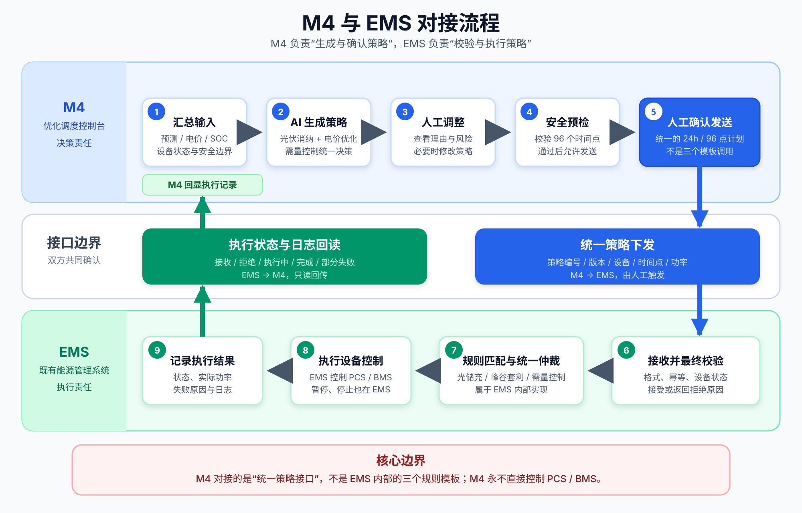

# M4 优化调度控制台概要设计

> 说明：本文记录 2026-09-03 的静态原型口径。数学优化器、AI 和 EMS 的最新生产设计以 [`docs/superpowers/specs/2026-09-04-m4-mathematical-optimizer-design.md`](./docs/superpowers/specs/2026-09-04-m4-mathematical-optimizer-design.md) 为准；其中已取消首版人工调整，并将 AI 收敛为“候选选择与解释”。

日期：2026-09-03  
状态：沟通评审稿  
目标：通过一个可交互的静态页面，把 M4 的产品定位、核心流程、系统边界和验收证据讲清楚，供项目、EMS、现场运维和验收人员共同评审。

## 1. 产品定位

M4 是“优化调度控制台”，不是新的综合能源监控系统，也不是直接控制 PCS/BMS 的设备执行系统。

M4 负责汇总调度所需信息，调用 AI 生成未来 24 小时策略草案，展示策略理由、预估效果和风险，支持人工调整及安全预检，并由操作员显式发送给既有 EMS。EMS 是唯一设备执行者；M4 只读取 EMS 的接收、拒绝和执行记录，用于操作反馈与验收举证。

首版不启用无人值守全自动闭环，不建设正式审批流程。操作员可以修改策略，修改后重新校验并主动发送给 EMS。

## 2. 本次静态原型的用途

静态原型用于跨团队沟通和页面框架确认，不连接真实 AI、M1–M3、EMS 或设备，也不包含任何生产凭据。

原型需要让评审人员直观看到：

- M4 需要哪些输入，AI 会输出什么；
- 操作员如何理解、调整、校验和发送策略；
- EMS 如何接收和执行，M4 如何读取结果；
- 附件 1 的 M4 4.1–4.5 如何在系统中形成证据；
- 哪些能力属于 M4，哪些继续由既有 EMS 负责。

页面所有数值均为内置演示数据。页面醒目标注“静态演示模式 · 不连接真实 AI/EMS”，所有按钮只改变本地展示状态。

## 3. 设计范围

### 3.1 原型包含

- 与现有 M3 页面一致的浅色/深色主题和控制台视觉语言；
- “策略工作台”“策略与执行记录”“验收看板”三个主区域；
- 两套储能的未来 24 小时、15 分钟粒度策略表达；
- AI 策略生成、策略解释、效果预估和风险提示的演示；
- 人工调整策略片段、重新校验和模拟发送 EMS；
- EMS 接收、拒绝、执行中、已完成和部分失败等示例状态；
- 策略原始版本、人工修改版本和 EMS 执行记录之间的关联；
- 附件 1 中 4.1–4.5 的验收映射。

### 3.2 原型不包含

- 真实 AI 调用、模型选型和 Prompt 设计；
- 真实 EMS 接口、PCS/BMS 控制或设备协议；
- 电价、设备参数、账号和权限的维护后台；
- 完整设备实时监控、实时曲线或告警中心；
- 数据库存储、跨浏览器持久化和正式审计；
- “电费降低 ≥5%”的最终计算口径和真实达标结论；
- 生产安全认证或可用于现场执行的控制能力。

## 4. 用户与职责

- 能源管理人员：主要使用者，生成、查看、调整、校验并发送策略。
- 现场运维人员：查看 EMS 执行结果；需要暂停、停止或切回现场控制时进入 EMS 操作。
- 管理层与验收人员：只读查看策略效果、执行证据和 4.1–4.5 验收映射。

静态原型不实现登录和权限，只通过界面文案体现“可操作”和“只读”两类角色边界。

## 5. 系统边界与数据流

[](./M4-EMS对接流程图.svg)

> 点击流程图可以查看大图。图中 EMS 被视为执行黑盒：M4 只对接统一策略下发、接收结果和执行回读接口，不直接调用 EMS 内部的光储充调度、峰谷套利或需量控制模板。

关键边界：AI 只生成策略；M4 不直接控制设备；EMS 负责最终校验、执行、暂停和停止；PCS/BMS 只接受 EMS 控制。

### 5.1 双方只需确认的接口

1. **设备状态与能力接口**：EMS 向 M4 提供设备在线状态、SOC、可充放电功率和安全上下限。
2. **统一策略下发接口**：M4 向 EMS 提交策略编号、版本、两套储能及 24 小时 96 个时间点的目标功率。
3. **接收结果接口**：EMS 返回已接收或已拒绝；拒绝时提供错误码、原因和问题时间点。
4. **执行状态与日志接口**：EMS 返回待执行、执行中、已完成、部分失败或已停止状态，以及实际执行功率和日志。

EMS 内部如何选择规则模板、处理模板间优先级、绑定具体设备和生成控制指令，由 EMS 团队负责；M4 不依赖这些内部实现细节。

## 6. 页面信息架构

### 6.1 页面顶部

展示“M4 能源优化调度”标题、演示模式标识、当前数据时间、EMS 连接演示状态和主题切换。顶部提供三个区域的页内导航，不引入复杂侧边栏。

### 6.2 策略工作台

按“输入 → AI 策略 → 人工调整 → 安全预检 → 发送 EMS”的顺序组织：

1. 输入摘要：负荷预测、两套储能当前 SOC、光伏参考、电价版本、EMS 设备可用状态和调度目标。
2. AI 策略摘要：96 点计划的时间轴图，以及谷充、光伏余电充电、峰放和保留 SOC 等关键策略片段。
3. 决策说明：展示主要理由、预估购电峰值、光伏消纳和节费效果，并明确数值为演示估算。
4. 风险提示：显示输入过期、预测不确定或设备不可用等风险示例。
5. 人工调整：允许选择一个策略片段，修改开始/结束时间、充放电模式、目标功率和目标 SOC 区间。修改后策略进入“待重新校验”。
6. 安全预检：模拟展示“通过”“警告”或“阻断”。安全校验能否被人工强制绕过尚未确认，因此原型不提供绕过按钮。
7. 发送 EMS：只有校验通过时按钮可用。点击后仅模拟 EMS 接收并生成一条执行记录，不发出网络请求。

### 6.3 策略与执行记录

以时间顺序展示：AI 原始策略、人工调整、发送时间、EMS 接收/拒绝状态和执行回读。每条记录使用同一个策略编号和版本号串联，便于讨论未来审计字段。

原型至少提供两个可切换示例：

- 正常流程：EMS 已接收，策略执行中或已完成；
- 异常流程：EMS 拒绝或部分执行，展示原因，并提示“调整策略后重新发送”。

M4 不提供停止设备按钮。已经进入 EMS 的计划需要在 EMS 中暂停或停止，M4 仅显示回读状态。

### 6.4 验收看板

使用五个验收卡片映射附件 1：

- 4.1 优化调度模型：展示 AI 策略已生成、输入摘要、策略理由和安全预检结果；
- 4.2 电价策略：展示峰/平/谷/尖峰时间与充放电策略的对应关系；
- 4.3 光伏与储能调度：展示光伏直供、余电充电、谷充和峰放策略片段及 EMS 记录；
- 4.4 削峰填谷：展示需量逼近场景、建议放电动作和 EMS 触发结果；
- 4.5 电费降低：展示基准电费、策略电费和降低比例的界面位置，但明确最终基线与公式仍需甲乙双方确认。

原型不得把演示数据标记为“正式通过”，统一使用“演示证据已具备”或“口径待确认”。

## 7. 策略输入与输出框架

### 7.1 输入

- M3：未来 24 小时厂区负荷和两套储能 SOC 趋势；
- M1/M2：实时光伏、负荷、市电、储能和关口数据；
- 电价接口表：峰、平、谷、尖峰和需量价格；
- EMS：设备状态、能力和安全边界；
- 业务目标：削峰、谷充峰放、光伏消纳、节费和 SOC 储备。

M3 不新增光伏预测。首版使用实时与历史光伏形成调度参考基线；实时光伏余电判断本身不依赖预测。

### 7.2 输出

- 两套储能未来 24 小时、15 分钟粒度的充电、放电或待机计划；
- 目标功率和目标 SOC 区间；
- 每个关键策略片段的决策理由；
- 预计购电量、峰值需量、光伏消纳和节费效果；
- 数据质量、预测不确定性和设备状态风险。

AI 输出始终称为“策略草案”，不能称为设备指令。

## 8. 静态交互状态

页面初始展示一份已生成的演示策略，便于打开即评审。交互状态如下：

```text
演示策略已生成
  → 人工修改策略片段
  → 待重新校验
  → 校验通过 / 警告 / 阻断
  → 模拟发送 EMS
  → EMS 已接收 / 已拒绝
  → 执行中 / 已完成 / 部分失败
  → 验收证据更新
```

刷新页面即可恢复初始演示数据，不使用浏览器持久化。

## 9. 视觉与可用性原则

- 延续 M3 的浅色/深色主题、卡片、状态色和分区编号，降低跨模块认知成本；
- 首屏优先展示“当前输入是否可用、策略在做什么、是否可发送 EMS”；
- 24 小时策略用时间轴/曲线呈现，关键策略片段用可编辑表格呈现，避免直接铺开 192 行明细；
- 红色只用于阻断与失败，橙色用于风险/警告，绿色用于校验通过和 EMS 正常状态；
- 页面在桌面端完成主要评审，同时保证窄屏不溢出、不遮挡；
- 所有按钮可通过键盘访问，状态变化有清晰文字，不只依赖颜色。

## 10. 原型验收条件

- HTML 文件可直接打开，无需构建、服务端或网络资源；
- 三个主区域均可导航和阅读；
- 主题切换、策略片段选择与修改、安全预检、模拟发送及示例状态切换可用；
- 修改策略后必须重新校验，阻断状态下不能模拟发送；
- 页面始终标明演示模式，不产生真实网络请求；
- 浏览器控制台无脚本错误；
- 常见桌面宽度和 320px 窄屏下无内容重叠或横向页面溢出；
- 页面内容与本文档的 M4/EMS/AI 边界一致；
- 验收看板完整映射 4.1–4.5，且不伪造正式验收结论。

## 11. 后续沟通清单

以下事项不阻塞静态原型，但在正式系统设计前必须确认：

1. EMS 是否提供策略接收、拒绝原因、状态回读和执行日志接口；
2. 两套 PCS 的真实设备标识、可写能力和安全约束；
3. 电价接口表的字段、鉴权、需量口径和生效规则；
4. AI 厂商、模型、输入输出契约、失败重试和版本留痕；
5. 策略自动生成、日内建议重算和人工发送的时间节奏；
6. 安全校验失败是否绝对禁止绕过；
7. “电费降低 ≥5%”的基线月份、计算公式、归一化方式和证据效力；
8. 可操作/只读角色如何映射到现有账号体系。

## 12. 交付物

- `m4/M4优化调度控制台.html`：可交互静态原型；
- `m4/M4优化调度控制台概要设计.md`：本沟通与评审依据；
- `m4/2026-09-03-M4-需求拷打.md`：完整需求提取与决策记录。
