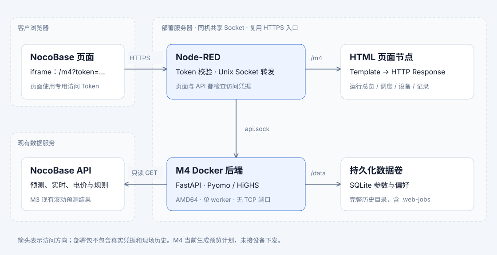

# M4 部署手册

版本：2026-09-09 Socket 版。部署方式：**Node-RED 提供 HTML 并校验 iframe Token，NocoBase 内嵌 URL，Linux AMD64 服务器运行 Docker 后端**。后端通过 Unix Socket 通信，不监听 TCP 端口；复用现有 Node-RED 的 HTTPS 访问地址，不新增 Nginx。

当前页面包含运行总览、调度计划、设备与数据、运行记录。M4 生成调度预览，尚未接入设备下发、执行回读或自动滚动调度。

## 1. 部署链路与文件



```text
NocoBase iframe → https://你的Node-RED域名/m4?token=访问Token&station=s1
                    ├─ Node-RED 校验 Token → 返回 HTML
                    └─ 页面 /m4-api 请求携带 Bearer
                         → Node-RED 校验 Token → Docker 后端 api.sock
                                                    ├─ 持久化参数与历史
                                                    └─ 只读访问 NocoBase 数据
```

页面和 `/m4-api/` 位于同一个 Node-RED 域名，不需要在 HTML 填后端 IP，也不需要 CORS。Node-RED 与 M4 必须在同一台服务器，共享 Socket 目录；两容器不需要为了 M4 API 加入同一 Docker 网络。

| 交付文件 | 用途 |
|---|---|
| `node_red/m4_customer_template.html` | 完整 HTML，可粘贴至 Node-RED Template 节点 |
| `node_red/m4_customer_flow.json` | 正式部署用 Flow，包含页面、Token 校验和 API 转发 |
| `node_red/env.example` | Node-RED 环境变量填写示例 |
| `node_red/*.js` | Flow 中的 Function 源码，便于维护 |
| `backend/` | Dockerfile、Compose、锁定依赖、启动/检查脚本及后端源码 |
| `secrets/README.txt` | 凭据目录说明，未附真实凭据 |
| `验收记录.md`、`SHA256SUMS` | 已执行检查的范围、交付文件校验和 |

这是源码部署包，不含离线 Docker 镜像 tar、本机配置、参数库或历史记录。按用户要求，本次不做机器上的 Flow 导入验证；以下操作留到具备部署机器后执行。

## 2. 部署前填写的配置

以下域名是填写示例，部署时按实际页面地址修改。Origin 仅含协议、域名和可选端口，末尾不带斜杠或路径。

| 配置 | 示例 | 配置位置 |
|---|---|---|
| M4 页面 Origin | `https://opdash.lvkpower.com` | Node-RED 的 `M4_PUBLIC_ORIGIN` |
| NocoBase 父页面 Origin | `https://ems.lvkpower.com` | Node-RED 的 `M4_FRAME_ORIGIN` |
| M4 专用访问 Token | 随机生成 64 位十六进制字符串 | Node-RED 的 `M4_IFRAME_TOKEN`，并填入 iframe URL |
| Node-RED 中的 Socket 路径 | `/run/vifa-m4/api.sock`（容器内） | Node-RED 的 `M4_SOCKET_PATH` |
| 宿主机共享目录 | `/opt/vifa/m4/socket` | 后端 `.env` 的 `M4_SOCKET_DIR`，以及 Node-RED 挂载 |
| 数据源只读 Token | NocoBase 为后端分配的只读 API Token | `secrets/nocobase_token.txt` |

**两个 Token 用途不同。** iframe Token 用于打开和操作 M4；数据源 Token 用于后端取数。不要把数据源 Token 填入 iframe URL。

本包默认采用 M4 专用共享访问 Token，并不校验 NocoBase 当前登录用户或角色。持有该访问 Token 的人可读取两站 M4 数据、修改本地调度参数/偏好并发起预览计算；它不具有设备下发功能。若以后要按 NocoBase 用户或电站分权，需要另外接入用户权限校验。

## 3. 上传部署包并准备后端凭据

服务器需要 Linux AMD64、Docker Engine、Docker Compose V2，以及现有 Node-RED。Docker 构建需要联网下载基础镜像和锁定的 Python 包；后端运行需要访问 `https://vifa.hlszh.com/api/`。

将 ZIP 解压到独立发布目录，例如 `/opt/vifa/m4/releases/20260909/`。以下命令由部署人员在服务器上执行：

```bash
cd /opt/vifa/m4/releases/20260909/m4-deployment-20260909-socket
sha256sum -c SHA256SUMS
docker version
docker compose version
```

先验证校验和，再填写配置。通过隐藏输入创建后端 Token 文件：

```bash
sudo install -d -m 700 secrets
sudo python3 - <<'PY'
import getpass, os
value = getpass.getpass('NocoBase read-only API token: ').strip()
assert value and not any(c.isspace() for c in value) and '\x00' not in value
fd = os.open('secrets/nocobase_token.txt', os.O_WRONLY | os.O_CREAT | os.O_TRUNC, 0o600)
os.fchmod(fd, 0o600)
with os.fdopen(fd, 'w') as output:
    output.write(value + '\n')
PY
```

Compose 将文件挂载为 `/run/secrets/nocobase_token`。启动脚本读取凭据、初始化数据目录，再以 UID/GID `10001` 运行应用；凭据不写入镜像层。[Docker Compose secrets](https://docs.docker.com/compose/how-tos/use-secrets/)

## 4. 构建和启动 AMD64 后端

```bash
cd backend
cp .env.example .env
# 按实际情况编辑 .env 中的镜像标签、Socket 目录和数据卷名。
sudo install -d -o 10001 -g 10001 -m 2750 /opt/vifa/m4/socket
docker compose build
docker compose up -d
docker compose ps
docker compose logs --tail=80 m4-api
```

Compose 已固定 `platform: linux/amd64`，默认镜像标签 `vifa-m4-api:socket-20260909`，没有 `ports` 映射。命名卷 `vifa-m4-data` 挂载到 `/data`；宿主机的 `M4_SOCKET_DIR` 挂载到 `/run/vifa-m4`。

后端只创建 `/run/vifa-m4/api.sock`：目录归属 `10001:10001`、权限 `2750`，Socket 权限 `0660`。启动脚本在降权后创建 Socket 并把已经打开的监听句柄交给 Uvicorn，不额外开启 TCP。运行锁阻止两个实例使用同一路径；非 Socket 文件或仍在使用的 Socket 会使启动失败，不会被覆盖。[Uvicorn Socket 配置](https://www.uvicorn.org/settings/)

如果修改 `M4_SOCKET_DIR`，先创建新目录并同步 Node-RED 挂载；M4 容器内固定路径仍为 `/run/vifa-m4/api.sock`。不要手工复制 Socket 文件或删除运行中的 `server.lock`。

保留**一个容器、一个 Uvicorn worker**。候选缓存及求解锁包含进程内状态，当前版本不支持多个 worker 或副本；数据卷应使用本机文件系统，不使用 NFS 共享运行目录。

有机器后可运行本地检查：

```bash
docker compose exec -T m4-api python /opt/m4-runtime/preflight.py
docker compose exec -T m4-api python /opt/m4-runtime/healthcheck.py
```

`preflight.py` 检查依赖、HiGHS 可用性、数据目录权限及最近任务标记；退出码 0 表示通过，1 表示检查失败，2 表示最近任务仍标记 running、不宜停机更新。健康检查通过 Unix Socket 读取本地参数库，不访问数据源或启动求解。healthy 不代表真实输入已就绪。

## 5. 配置 Node-RED：共享目录、权限与 Token

Node-RED 与后端共享**目录**，不要单独挂载 `api.sock` 文件，因为它会在重启时重新创建。

### Node-RED 在 Docker 中

在现有 Node-RED Compose 服务合并以下设置，保留原有数据卷、端口和网络：

```yaml
services:
  node-red:                          # 替换为现有服务名
    env_file: /etc/vifa/m4-node-red.env
    group_add:
      - "10001"
    volumes:
      - /opt/vifa/m4/socket:/run/vifa-m4:ro
```

共享挂载使用只读方式；Unix Socket 连接权限由 Socket 的组写权限决定，Node-RED 无须修改目录或 Socket 文件。后端仍需原有网络访问 NocoBase 数据源，但内部 M4 API 不走 TCP 网络。

### Node-RED 直接运行在宿主机

将实际 Node-RED 服务用户加入 GID `10001` 的 M4 通信组，并重启服务使补充组生效；`M4_SOCKET_PATH` 使用宿主机路径 `/opt/vifa/m4/socket/api.sock`。部署人员先确认 GID `10001` 可用于该通信组；如已属于其他业务组，应统一规划权限，不能随意借用无关组。

### 配置四个环境变量

参考 `node_red/env.example`，在现有 Node-RED 环境中设置：

```dotenv
M4_IFRAME_TOKEN=填写随机生成的64位十六进制访问Token
M4_PUBLIC_ORIGIN=https://opdash.lvkpower.com
M4_FRAME_ORIGIN=https://ems.lvkpower.com
M4_SOCKET_PATH=/run/vifa-m4/api.sock
```

最后一行是容器中的路径，宿主机部署按上文修改。路径必须为不含空格或 `..` 的绝对 `.sock` 路径，最长 100 个字符。旧版 `M4_BACKEND_URL` 和 `M4_BIND_PORT` 已不使用。

可在服务器生成受保护的环境文件；执行前修改两个示例 Origin 和 Socket 路径。命令不覆盖已有文件、不打印 Token：

```bash
sudo install -d -m 700 /etc/vifa
sudo python3 - <<'PYCONFIG'
import os, secrets
fd = os.open('/etc/vifa/m4-node-red.env', os.O_WRONLY | os.O_CREAT | os.O_EXCL, 0o600)
with os.fdopen(fd, 'w') as output:
    output.write('M4_IFRAME_TOKEN=' + secrets.token_hex(32) + '\n')
    output.write('M4_PUBLIC_ORIGIN=https://opdash.lvkpower.com\n')
    output.write('M4_FRAME_ORIGIN=https://ems.lvkpower.com\n')
    output.write('M4_SOCKET_PATH=/run/vifa-m4/api.sock\n')
PYCONFIG
```

宿主机 systemd 部署：在实际服务的 `[Service]` 中合并 `EnvironmentFile=/etc/vifa/m4-node-red.env`，执行 `systemctl daemon-reload` 并重启对应 Node-RED 服务。Docker Compose 部署：由能读取环境文件的部署用户更新现有 Node-RED 服务；单纯 `docker restart` 不会注入新增变量、挂载或补充组。

### 在 settings.js 提供内置 HTTP 模块

将 `node_red/settings.fragment.js` 的内容合并到现有 Node-RED `settings.js` 的 `module.exports` 对象中。已有 `functionGlobalContext` 时，仅追加 `m4Http`，保留其他条目：

```javascript
functionGlobalContext: {
    m4Http: require('http')
},
```

这是 Node.js 内置模块，不需要安装 npm 包或启用 Function 外部模块下载。Flow 使用它的 `socketPath` 发出 HTTP 请求，不执行 shell/curl，不设置 TCP 后备地址，也不自动重试或跟随重定向。更新 settings.js 后重启 Node-RED。[Node-RED Function 加载模块](https://nodered.org/docs/user-guide/writing-functions#loading-additional-modules)、[Node.js HTTP](https://nodejs.org/api/http.html)

Node-RED 缺少 Token/Origin 或格式不正确时拒绝请求并返回 503；缺少 `m4Http` 时返回“Socket 转发尚未配置”。Token 要求 32–512 个字符，仅允许字母、数字和 `._~-`，建议上述 64 位十六进制值。

## 6. 将 HTML 和 API 路由放入 Node-RED

有部署机器后，在现有 Node-RED 中导入 `node_red/m4_customer_flow.json` 并 Deploy。它使用内置 HTTP In、Function、Template、HTTP Response 和 Catch 节点，不要求额外安装节点包。

页面链路是 `GET /m4 → 校验页面 Token → Template → HTTP Response`；API 链路是 `GET/PUT/POST /m4-api/... → 校验 Bearer → 限定接口 → Socket 请求 Function → HTTP Response`。完整 Flow 已嵌入同一份 HTML，不需要再额外粘贴一次。

如果以后只更新页面，将 `m4_customer_template.html` 全文替换到既有 Template 节点：

| Template 配置 | 值 |
|---|---|
| 属性 | `msg.payload` |
| 模板语法 | Plain text / 纯文本 |
| 编辑器格式 | HTML |
| 输出 | String / 字符串 |
| HTTP Response | 200、`Content-Type: text/html; charset=utf-8` |

不要只创建三个页面节点而遗漏 Token/API 节点；单独放入 HTML 无法提供后端转发。不要使用 Dashboard 的 `ui_template` 代替 HTTP Template，也不要重复导入造成同一个 `/m4` 多条路由。[Node-RED HTTP 页面示例](https://cookbook.nodered.org/http/create-an-http-endpoint)、[Template 节点](https://nodered.org/docs/user-guide/nodes#template)

正式外部路径应同时为 `/m4` 和 `/m4-api/...`。HTML 的 API 路径从域名根开始；若现有 `httpNodeRoot` 或入口将路由放在 `/tools/` 等前缀下，需要按现有入口配置将这两组路径一致映射，不能只让 `/tools/m4` 可访问而遗漏根路径 API。

Node-RED 只转发规定的两站接口，不接收浏览器指定的后端地址。校验通过后，它清除浏览器的 Token/Cookie/Origin，并为本地后端设置 `Host: localhost`，以适配后端现有本地访问约束。保持这些 Function 完整，Socket 只共享给后端与 Node-RED。

## 7. NocoBase 配置 iframe URL

在 NocoBase 的 iframe 区块填写：

```text
https://opdash.lvkpower.com/m4?token=你的M4专用访问Token&station=s1
```

`station=s1` 为电站 1，`station=s2` 为电站 2；页面仍可切换电站。将域名及 Token 替换成第 5 节实际值。普通 iframe 区块使用 URL 即可；若手写 HTML 属性，参数间的 `&` 写为 `&amp;`。不要添加演示/离线模式参数。[NocoBase iframe 区块](https://docs.nocobase.com/integration/block-iframe/)

HTML 从 URL 读取 Token，仅保存在页面内存中；API 请求通过 `Authorization: Bearer …` 发送，API URL 不附 Token。页面设置 `no-referrer`，避免通过 Referer 传递带凭据 URL；URL 保留 Token 以支持刷新。部署入口的访问日志仍须避免记录完整 Token 查询参数，分享页面地址也会同时分享访问权限。

继续使用现有 HTTPS 页面入口，不新增 Nginx。若 Node-RED 目前仅有裸 HTTP，需要先为现有入口启用 HTTPS；Node-RED 本身也可通过 `settings.js` 的 `https` 配置加载证书。HTTPS 同时避免 NocoBase 混合内容拦截，并满足页面生成请求标识使用的安全上下文要求。[Node-RED 运行时配置](https://nodered.org/docs/user-guide/runtime/configuration)

Flow 返回 `Content-Security-Policy: frame-ancestors 'self' <M4_FRAME_ORIGIN>`。现有入口不能再叠加禁止该父域的 `X-Frame-Options` 或更严格 CSP；NocoBase 父页面的 `frame-src` 也需允许 M4 域。若配置 iframe sandbox，至少保留页面所需的 `allow-scripts allow-same-origin`；产生 `null` Origin 会导致保存被拒绝。[frame-ancestors](https://developer.mozilla.org/en-US/docs/Web/HTTP/Reference/Headers/Content-Security-Policy/frame-ancestors)

后续轮换访问 Token 时，同时更新 Node-RED 环境和 NocoBase iframe URL。它不替代 NocoBase 用户登录。若现有 Node-RED 还有 `httpNodeAuth` 等额外认证，需沿用现有接入方式解决兼容，不应直接移除原有保护。

## 8. 第一次使用与业务范围

进入页面后，按电站保存调度参数及运营偏好，再查看“设备与数据”中的输入状态。数据未就绪时按页面原因处理，不通过关闭校验绕过。

“刷新计划”读取已有记录；刷新输入会读取上游；“生成调度计划”启动新的预览计算。正式运行前需确认真实参数、数据权限和输入时效；本次材料准备不自动触发这一步。

当前后端数据源固定为 `https://vifa.hlszh.com/api/`，没有通过 `.env` 修改数据源域名的选项。换 NocoBase 实例需要修改并验证 `m4_settings/upstream.py`、`control_sources.py` 的来源白名单，不能只换 Token。

| M4 电站 | 上游编号 | 柜 |
|---|---|---|
| station-1 / s1 | ES01 | emu11、emu12 |
| station-2 / s2 | ES02 | emu21–emu26 |

后端只读 Token 涉及：`t_need`、`re_flow`、`t_model`、`t_emu`、`t_es_data`、`t_peak_diy`、`t_rate`、`energy_forecast_latest`、`energy_forecast_manual_runs`、`energy_forecast_manual_points`。

负荷读取 M3 已有滚动预测，不触发 M3 任务；保留现有手动预测补缺兼容。预测窗口需连续 95 或 96 点，只允许裁去末尾缺失的一格。SOC、告警、采样时效和逐柜参与规则沿用当前实现。此前上游存在间歇读取失败，本部署包没有修复该问题，也没有新增自动刷新或自动调度。

## 9. 持久化、迁移与备份

数据卷中需要保留：

```text
/data/settings.sqlite3            # 调度参数和运营偏好
/data/settings.sqlite3-*          # 如存在，SQLite 辅助文件
/data/solver-decisions/           # 完整历史，包含隐藏 .web-jobs 和锁文件
```

旧服务默认数据位于 `m4/run/`；如配置过环境变量，以实际路径为准。迁移前确认两站没有 running 任务，再停止旧服务，将参数库和整个历史目录迁到新卷，保持目录结构；不要在写入期间直接复制 SQLite，或遗漏隐藏文件。

以下备份示例在 `backend/` 目录执行。先将镜像与卷名改为 `.env` 的实际值，并通过页面或 `preflight.py` 确认没有运行中任务：

```bash
docker compose stop m4-api
mkdir -p ../backups
M4_BACKUP_FILE="../backups/m4-data-$(date +%Y%m%dT%H%M%S).tar.gz"
docker run --rm --platform linux/amd64 --network none --read-only \
  --user 10001:10001 --entrypoint python \
  -v vifa-m4-data:/data:ro vifa-m4-api:socket-20260909 \
  -c 'import sys,tarfile; a=tarfile.open(fileobj=sys.stdout.buffer,mode="w|gz"); a.add("/data",arcname="data"); a.close()' > "$M4_BACKUP_FILE"
# 确认上一步退出码为0，再检查归档并启动服务。
tar -tzf "$M4_BACKUP_FILE"
docker compose up -d m4-api
```

备份辅助容器不挂载凭据；归档由宿主 shell 写入，避免容器受限权限导致备份目录不可写。Token 文件另按服务器凭据策略保存。不要执行 `docker compose down -v`，它会删除数据卷。

恢复时只使用可信备份，Socket 目录不属于业务备份，重启自动创建，迁移时只需按第 4–5 节重新准备。恢复时先创建新命名卷，在独立辅助容器中还原完整 `data/` 内容，并将新卷内数据归属设为 `10001:10001`。校验恢复内容后，把 `.env` 的 `M4_DATA_VOLUME` 指向新卷，再启动并检查参数、偏好、历史。保留原卷作为回退，不覆盖当前卷。入口脚本只初始化顶层目录，不会递归修复迁入文件的所有权；本次没有进行现场恢复演练。

## 10. 更新、回滚与离线构建

- 更新 HTML：替换原 Template 内容并 Deploy，保留原 API/认证节点。
- 更新后端：确认无运行中任务并备份；上传新发布目录，保留原 Token 和数据卷，为新镜像设置独立标签，执行 `docker compose build`、`docker compose up -d`。
- 回滚：停止新容器，使用保留的旧镜像标签；数据格式变化时切回兼容的原卷/备份，不假定旧代码能够读取新记录。

容器停止可能中断后台计算线程；重启后相关记录会标记 interrupted，不自动重算。增加停止等待时间不能替代更新前确认无任务。

服务器不能联网构建时，在可联网构建机按 AMD64 构建后导出镜像，再上传服务器：

```bash
# 在部署包 backend/ 目录，镜像标签与服务器 .env 保持一致。
docker build --platform linux/amd64 -t vifa-m4-api:socket-20260909 .
docker save -o vifa-m4-amd64-20260909-socket.tar vifa-m4-api:socket-20260909
# 上传 tar 后在服务器执行：
docker load -i vifa-m4-amd64-20260909-socket.tar
# 设置 .env 的 M4_IMAGE=vifa-m4-api:socket-20260909 后：
docker compose up -d --no-build
```

当前 ZIP 不包含上述镜像 tar。已执行的构建和本地检查见 `验收记录.md`，不代表生产 AMD64 机器已经部署或完成性能验收。

## 11. 常见问题

| 现象 | 检查项 |
|---|---|
| 页面 401 | iframe URL 的访问 Token 是否与 Node-RED 环境一致；是否仍使用旧 Token |
| 页面/API 503，提示访问配置未完成 | 四个 Node-RED 变量是否注入，Token/Origin 格式是否正确，进程是否已重启 |
| 页面正常、API 404 | 是否遗漏完整 API Flow；外部 `/m4-api/` 是否可到达 Node-RED；是否只配置了带前缀页面路径 |
| API 502 | 后端是否运行、Socket 是否存在、目录挂载是否正确、Node-RED 补充组是否包含 10001 |
| API 400 Invalid host | 转发 Function 的 `Host: localhost` 是否被修改 |
| 保存 403 | `M4_PUBLIC_ORIGIN` 是否为 M4 自己的 HTTPS Origin；是否误填 NocoBase 父域或 sandbox 造成 null Origin |
| iframe 被拒绝 | HTTPS、父/子页面 CSP、X-Frame-Options、现有入口额外响应头 |
| healthy 但无输入 | 数据源 Token、表权限、DNS/证书、95/96 点覆盖、柜状态与采样时效 |
| 重启后参数/记录为空 | 数据卷名/挂载路径是否改变；历史迁移是否遗漏 |
| Socket EACCES / Permission denied | Node-RED 是否有补充组 10001；父目录可遍历，Socket 权限为 0660；不要用 chmod 777 绕过 |
| 参数库 Permission denied | 数据目录及迁移文件所有权是否为 10001:10001 |
| Socket 转发尚未配置 | settings.js 的 functionGlobalContext 是否已合并 m4Http 并重启 |

重新从仓库生成发布包时，在实际 Python 项目 `vifa/` 内执行：

```bash
python3 m4/deploy/build_package.py --output /path/to/new/m4-deployment-20260909-socket
```

输出目录必须不存在。生成脚本按白名单复制后端源码，生成 HTML、Flow、手册、校验清单及 ZIP，不复制现场凭据和运行数据。旧版端口部署包保留作为版本记录，新部署请使用文件名带 `-socket` 的包。
