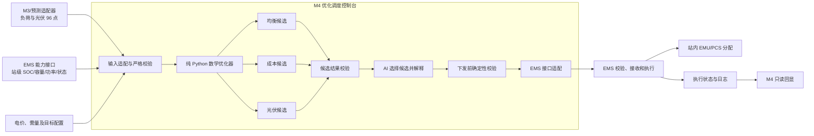

# M4 数学优化器设计

日期：2026-09-04
状态：已确认
范围：M4 首版纯 Python 数学优化核心，以及它与 M4 编排层、AI 和 EMS 的边界

## 1. 文档目的

本文定义 M4 数学优化器的首版技术基线，用于后续实现、测试、接口沟通和验收举证。

本设计以 2026-09-04 确认结果为准。若与 `m4/2026-09-03-M4-需求拷打.md` 或 `m4/M4优化调度控制台概要设计.md` 中“AI 直接生成数值计划”“人工调整计划”等早期原型口径冲突，以本文为准：

- 数学优化器生成三套可执行候选；
- AI 只选择候选并解释，不生成或修改数值计划；
- 首版暂不支持人工调整计划；
- EMS 是唯一设备执行者，M4 和 AI 均不直接控制 PCS/BMS。

## 2. 目标与非目标

### 2.1 目标

- 面向两个独立电站，分别生成未来 24 小时、15 分钟粒度、共 96 点的站级储能计划；
- 支持需量削峰、峰谷套利、光伏自用和减少无收益循环；
- 在相同硬约束下生成“均衡、成本优先、光伏优先”三套候选；
- 使用可配置、可版本化的分层优化目标，确保低优先级目标不能抵消高优先级目标；
- 输出可复算的功率平衡、SOC 轨迹和业务指标；
- 将优化计算与数据访问、AI、EMS 和界面彻底隔离，便于自动化测试。

### 2.2 非目标

- 不在首版优化核心中访问数据库、M3、AI 或 EMS；
- 不把站级计划拆分到单台 EMU；
- 不直接生成 PCS/BMS 控制指令；
- 不建设人工计划调整和锁定时段能力；
- 不建设复杂电池温度、倍率或寿命衰减模型；
- 不在优化器内部猜测或插补缺失预测；
- 不在本阶段接入真实 AI 或真实 EMS，也不修改现有 M4 静态页面。

## 3. 系统边界



### 3.1 电站隔离

- 电站 1 包含 `emu11`、`emu12`；电站 2 包含 `emu21` 至 `emu26`；
- 两站不共享关口计量、需量上限、能力快照、策略配置、计划版本或 EMS 任务；
- 每个电站独立完成输入校验、求解、AI 选择、下发和异常处理；
- 任一电站失败不得阻断另一电站。

### 3.2 EMS 聚合能力边界

EMS 按电站向 M4 提供聚合可调度能力：

- 当前站级 SOC 或可用电量；
- 当前可用容量；
- 最大充电功率和最大放电功率；
- 充电效率和放电效率；
- 可用状态、降额状态及对应能力边界。

M4 只在该聚合边界内生成站级计划，不自行决定站内 EMU 分配。EMS 负责把站级功率目标拆分到具体设备，并执行自身的设备保护和最终校验。

## 4. 模块形态

首版采用“M4 编排层 + 纯 Python 数学优化核心”，不拆分独立微服务。

建议代码结构：

```text
m4_optimizer/
├── __init__.py
├── contracts.py        # 输入、输出与配置模型
├── validation.py       # 请求和结果的确定性校验
├── model.py            # MILP 变量、约束和线性目标
├── lexicographic.py    # 分层求解与目标锁定
├── solver.py           # SciPy/HiGHS 调用及状态映射
├── metrics.py          # 业务指标复算
├── profiles.py         # 外部目标配置解析
└── service.py          # 一次请求生成三套候选
```

优化核心不得依赖 FastAPI 请求上下文、数据库会话、外部 HTTP 客户端、AI SDK 或 EMS 客户端。

## 5. 求解器选择

首版使用 `scipy.optimize.milp`，底层采用 HiGHS 求解混合整数线性规划。

原因：

- 96 点模型规模适合线性连续变量加少量二进制变量；
- 支持时间限制和求解状态读取；
- 可以通过多轮求解实现分层优化；
- 项目锁文件已有 SciPy 的传递依赖，实施时仍须将 SciPy 增加为显式固定依赖，不能依赖其他包偶然安装。

首版不采用 OR-Tools CP-SAT，避免所有功率、能量和价格都进行整数缩放；不采用 Pyomo 加外部求解器，避免额外部署和进程管理成本。

## 6. 优化器输入契约

核心入口接收一个 `OptimizationRequest`。字段名使用英文，本文表格为接口语义，不限定最终序列化框架。

### 6.1 请求头

| 字段 | 说明 |
|---|---|
| `request_id` | 一次优化请求的唯一标识 |
| `station_id` | 独立电站标识 |
| `plan_start_at` | 计划起点，必须包含时区 |
| `interval_minutes` | 固定为 15 |
| `horizon_points` | 固定为 96 |
| `input_observed_at` | 本轮实时能力数据时间 |
| `source_versions` | 预测、电价、EMS 快照等来源版本 |

### 6.2 96 点时间序列

每个时间点至少包含：

| 字段 | 单位 | 说明 |
|---|---:|---|
| `timestamp` | ISO 8601 | 连续且严格递增的 15 分钟时间点 |
| `load_forecast_kw` | kW | 不含储能充放电功率的站内原生负荷 |
| `pv_forecast_kw` | kW | 可用于本站的光伏交流功率预测或调度基线 |
| `buy_price_per_kwh` | 元/kWh | 对应时段购电价格 |
| `sell_price_per_kwh` | 元/kWh | 上网价格，默认配置为 0 |

`load_forecast_kw` 不能直接使用关口净负荷，否则会把储能功率重复计入能量平衡。储能辅机用电只能选择“已纳入原生负荷”或“作为独立负荷项”中的一种方式，不得重复计算。

未来光伏数据由输入适配层提供；它可以来自独立预测或历史基线，但来源算法不属于优化核心。

### 6.3 EMS 聚合能力

| 字段 | 说明 |
|---|---|
| `available` | 电站储能当前是否可调度 |
| `initial_soc_pct` | EMS 实时 SOC，是唯一初始 SOC |
| `energy_capacity_kwh` | 当前有效站级能量容量 |
| `max_charge_kw` | 当前聚合最大充电功率 |
| `max_discharge_kw` | 当前聚合最大放电功率 |
| `charge_efficiency` | 充电效率，范围 `(0, 1]` |
| `discharge_efficiency` | 放电效率，范围 `(0, 1]` |
| `derating_reason` | 可选降额原因，仅用于风险说明和审计 |

M3 的未来 SOC 预测不进入 SOC 状态方程，也不作为硬约束；只允许编排层把它作为候选风险参考。

### 6.4 运行约束

| 字段 | 说明 |
|---|---|
| `soc_min_pct` / `soc_max_pct` | SOC 绝对上下限，硬约束 |
| `preferred_soc_min_pct` / `preferred_soc_max_pct` | 推荐运行区间，软目标 |
| `terminal_soc_tolerance_pct` | 终端 SOC 相对初始 SOC 的容差，默认 5 个百分点 |
| `demand_limit_kw` | 本站需量控制上限 |
| `grid_import_limit_kw` | 可选的物理进线功率上限 |
| `grid_export_enabled` | 是否允许反送 |
| `grid_export_limit_kw` | 允许反送时的功率上限 |
| `cycle_cost_per_kwh` | 简单吞吐循环成本 |

### 6.5 目标配置

目标配置由外部传入，不写死在优化器中，至少包含：

- `profile_id` 与 `profile_version`；
- `objective_order`；
- 每层使用的目标项和权重；
- `absolute_tolerance` 与 `relative_tolerance`；
- 均衡目标使用的成本和光伏指标归一化尺度。

系统提供全局默认配置，并允许按电站覆盖。每次结果必须记录实际使用的配置版本。AI 只能读取配置和结果，不能修改配置。

### 6.6 输入校验

以下情况直接拒绝求解：

- 时间点不是 96 个；
- 时间戳重复、乱序、间隔不是 15 分钟或时区不一致；
- 预测存在缺值、非有限数或不允许的负值；
- 容量、效率、SOC 或功率边界非法；
- SOC 绝对区间、推荐区间或终端约束相互矛盾；
- 配置缺少目标、出现未知目标或容差非法；
- EMS 能力快照超过编排层配置的最大新鲜度。

优化器内部不插值、不前向填充、不使用零值代替缺失值。输入错误返回结构化诊断，EMS 继续当前有效计划。

## 7. 数学模型

### 7.1 索引与变量

令时段 `t = 0..95`，每段长度 `Δt = 0.25 h`。主要变量：

- `charge_kw[t] >= 0`：充电功率；
- `discharge_kw[t] >= 0`：放电功率；
- `grid_import_kw[t] >= 0`：购电功率；
- `grid_export_kw[t] >= 0`：反送功率；
- `pv_unabsorbed_kw[t] >= 0`：无法被负荷、储能或电网吸收的光伏余量，只作风险量；
- `energy_kwh[t]`：时段边界的储能电量，共 97 个状态点；
- `demand_exceed_kw[t] >= 0`：逐点需量超限；
- `peak_demand_exceed_kw >= 0`：全时域最大超限；
- `charge_on[t]`、`discharge_on[t]`：充放电状态二进制变量；
- SOC 推荐区间上下偏离的非负松弛变量。

优化器内部始终把充电和放电建成两个非负变量，避免符号混淆。

### 7.2 功率平衡

对每个时间点：

```text
pv_forecast
+ grid_import
+ discharge
= load_forecast
+ charge
+ grid_export
+ pv_unabsorbed
```

模型不包含负荷削减变量，不能通过虚构负荷或切除生产负荷获得可行解。

### 7.3 SOC 状态方程

```text
energy[t+1]
= energy[t]
+ charge_efficiency * charge_kw[t] * Δt
- discharge_kw[t] * Δt / discharge_efficiency
```

并满足：

```text
energy[0] = energy_capacity_kwh * initial_soc_pct / 100
soc_min <= energy[t] / energy_capacity <= soc_max
```

终端状态满足：

```text
abs(soc[96] - initial_soc_pct) <= terminal_soc_tolerance_pct
```

终端允许区间还必须与 SOC 绝对上下限取交集。

### 7.4 充放电互斥与能力约束

```text
charge_kw[t] <= effective_max_charge_kw * charge_on[t]
discharge_kw[t] <= effective_max_discharge_kw * discharge_on[t]
charge_on[t] + discharge_on[t] <= available
```

EMS 降额后的有效功率直接作为上界。`available = false` 时所有充放电功率为 0。

模型还应禁止同一时段同时购电和反送，避免异常电价配置导致纯电网套利。

### 7.5 需量软约束

```text
demand_exceed_kw[t] >= grid_import_kw[t] - demand_limit_kw
peak_demand_exceed_kw >= demand_exceed_kw[t]
```

需量目标内部先最小化最大超限，再最小化超限持续量。需量目标不能覆盖 SOC、功率、设备状态、物理进线限额等硬约束，也不能触发负荷削减。

### 7.6 SOC 推荐区间

SOC 推荐区间通过线性松弛变量描述偏离程度，仅作为目标指标，不属于可行性硬约束。均衡策略优先减少这种偏离，从而保留安全余量。

### 7.7 光伏反送与不可吸收余量

- 允许反送时，`grid_export_kw[t]` 不得超过配置上限；
- 禁止反送时，`grid_export_kw[t] = 0`；
- 无法吸收的余量进入 `pv_unabsorbed_kw[t]`，在结果中标记风险；
- 该变量不是 M4 对光伏逆变器的限发指令，M4 不越权控制光伏。

光伏自用目标应最小化 `grid_export + pv_unabsorbed`，不能只统计反送而忽略不可吸收余量。

## 8. 分层优化

三套候选共享完全相同的硬约束，只使用不同的目标配置。

### 8.1 默认目标顺序

| 候选 | 默认分层目标 |
|---|---|
| 均衡策略 | 需量超限 → SOC 推荐区间偏离 → 归一化购电成本与光伏外送/余量综合值 → 循环吞吐量 |
| 成本优先 | 需量超限 → 购电成本 → 光伏外送/余量 → SOC 推荐区间偏离 → 循环吞吐量 |
| 光伏优先 | 需量超限 → 光伏外送/余量 → 购电成本 → SOC 推荐区间偏离 → 循环吞吐量 |

其中：

- 购电成本按分时价格计算，上网收入默认按 0 计算；
- 循环吞吐量为 `Σ(charge + discharge) * Δt`，简单循环成本在末级抑制无收益循环；
- 均衡综合值必须使用配置尺度归一化，不能直接把“元”和“kWh”相加；
- SOC、功率、设备状态等安全边界始终是硬约束，不出现在可降级目标序列中。

### 8.2 求解过程

每个候选从同一份请求建立独立模型：

1. 求解第一层目标，记录最优值；
2. 给该目标增加上界锁定约束；
3. 在锁定前序目标的模型上求解下一层；
4. 重复直到完成所有目标；
5. 独立复算约束和指标后输出候选。

最小化目标 `f` 的锁定上界为：

```text
f(x) <= f_best + max(absolute_tolerance,
                      relative_tolerance * abs(f_best))
```

若配置对零值需要额外尺度保护，由 `absolute_tolerance` 提供。任何后序求解都不得突破已加入的前序锁定约束。

## 9. 优化器输出契约

一次 `OptimizationRequest` 返回一个 `OptimizationResult`，其中包含三套候选或各自失败状态。

### 9.1 结果头

- `request_id`、`station_id`；
- `model_version`、`solver_name`、`solver_version`；
- 输入来源版本与时间；
- 每个目标配置版本；
- 开始时间、结束时间和求解耗时。

### 9.2 候选状态

每套候选独立返回：

- `optimal`：已证明最优；
- `feasible`：在时间限制内获得可行解但未证明最优；
- `infeasible`：模型不可行；
- `timeout`：未获得可接受解；
- `error`：建模或求解异常。

不能把 `feasible` 或 `timeout` 伪装成 `optimal`。是否允许向 AI 暴露未证明最优但已复验可行的候选，由编排层配置控制。

### 9.3 96 点计划

每个有效候选的计划点包含：

| 字段 | 说明 |
|---|---|
| `timestamp` | 计划时间点 |
| `mode` | `charge`、`discharge` 或 `idle` |
| `target_power_kw` | 始终为非负数，方向由 `mode` 表达 |
| `expected_soc_pct` | 时段执行后的预计 SOC |
| `grid_import_kw` | 预计购电功率 |
| `grid_export_kw` | 预计反送功率 |
| `pv_unabsorbed_kw` | 不可吸收光伏余量，仅作风险量 |
| `demand_exceed_kw` | 预计需量超限功率 |

`expected_soc_pct` 是状态方程计算结果，用于展示和验证，不是 EMS 的直接 SOC 控制目标。EMS 接收时间点、`mode` 和 `target_power_kw`。

### 9.4 汇总指标

- 预计购电费用、上网收入和净电能成本；
- 最大购电功率、最大需量超限和超限持续量；
- 光伏自用电量、自用率、反送电量和不可吸收余量；
- 充电量、放电量、总吞吐量和简单循环成本；
- 最低、最高和终端 SOC；
- 推荐 SOC 区间偏离量；
- 风险代码与可读说明。

## 10. AI 边界

AI 不属于数学优化核心。编排层只把有效候选的标识、确定性汇总指标、关键时段摘要和风险代码发送给 AI。

AI 输出至少包含：

- `selected_candidate_id`；
- 选择理由；
- 风险说明；
- 可选置信信息。

编排层只接受候选集合中已存在的 `selected_candidate_id`。AI 不能返回新功率值、修改 SOC 轨迹、修改目标顺序或放宽约束。

AI 超时、输出解析失败或选择无效候选时，按“均衡 → 成本 → 光伏”的固定顺序选择第一个有效候选。

## 11. 滚动运行与计划更新

每个电站每 15 分钟独立运行一次：

1. 读取预测、价格配置和 EMS 能力快照；
2. 构建并严格校验 96 点请求；
3. 生成三套候选并进行独立复算；
4. 由 AI 在有效候选中选择并解释；
5. 使用最新 EMS 快照执行下发前确定性校验；
6. 与 EMS 当前有效计划比较；
7. 仅在达到更新条件时发送 EMS；
8. 记录 EMS 接收结果、执行状态和日志。

比较未来 4 小时计划，满足以下任一条件才更新：

- 充电、放电或空闲模式发生变化；
- 连续两个点的功率差达到电站额定功率的 10%；
- 预计成本改善达到 1%；
- 设备能力、电价、需量限制或当前计划可行性发生变化。

未达到条件时记录新计算结果，但不重复发送 EMS。

## 12. 异常处理

| 异常 | 处理 |
|---|---|
| 输入缺失、错位、非法或过期 | 本轮不求解，返回数据质量诊断，EMS 继续当前计划 |
| 某个候选失败 | 标记该候选状态，保留其他有效候选 |
| AI 失败或选择非法候选 | 按固定回退顺序选择首个有效候选 |
| 下发前校验失败 | 不发送，记录约束错误 |
| EMS 拒绝或部分接受 | 只刷新该电站数据并立即重算一次 |
| 第二次仍失败 | 等待下一周期并告警，不影响另一电站 |
| 没有有效新计划且 EMS 没有当前有效计划 | 由 EMS 进入本地兜底控制 |
| 光伏无法吸收或反送 | 输出风险量，不生成光伏控制指令 |

每份计划必须包含 `request_id`、`plan_version`、`config_version` 和输入数据时间。EMS 应按计划版本进行幂等处理，避免重复下发。

## 13. 确定性结果校验

求解器返回值不能直接视为可下发计划。独立验证器必须：

- 重新计算 96 点功率平衡；
- 从 EMS 初始 SOC 重新递推 97 个 SOC 状态；
- 检查 SOC、充放电功率、设备可用性和进线硬上限；
- 检查充放电互斥以及购电/反送互斥；
- 检查终端 SOC；
- 重新计算所有汇总指标；
- 使用统一数值容差判断浮点误差；
- 验证输出时间轴和计划版本完整性。

候选生成后执行一次校验；AI 选择后使用最新能力快照再执行一次下发前校验。

## 14. 测试与验收

实现采用测试驱动开发。至少覆盖：

1. 峰谷价差场景产生谷充峰放，并满足终端 SOC；
2. 午间光伏余电优先充电并降低反送或不可吸收余量；
3. 预测需量超限时优先放电削峰；
4. 储能能力不足时保留安全边界并正确报告需量超限；
5. 三类策略都不越过 SOC、功率和设备状态硬约束；
6. 任一时点不同时充放电，也不同时购电反送；
7. 设备不可用时输出零充放电计划；
8. 缺点、错位、非法效率和非法容量被拒绝；
9. 后序目标不能突破前序目标容差；
10. 两个电站的请求、结果和失败完全隔离；
11. 独立验证器能够识别被篡改的功率或 SOC 计划；
12. 上网价格为 0 时不把光伏反送虚报为收益；
13. 禁止反送时正确报告不可吸收余量且不输出限发指令；
14. 相同输入和配置生成可重复验证的结果及完整版本信息。

测试以约束、指标和目标层级为断言重点；存在多个等价最优解时，不要求每个功率点与固定样本完全一致。

## 15. 分阶段实施

### 阶段 A：纯优化核心

- 契约、校验器和测试数据工厂；
- 单策略 MILP 模型；
- 分层求解；
- 三候选服务；
- 指标复算和结果验证；
- 单元测试、场景测试和性能基线。

### 阶段 B：M4 编排层

- M3/光伏/电价/EMS 输入适配；
- 双站独立调度任务；
- AI 候选选择和固定回退；
- 计划变化判断、版本和审计记录。

### 阶段 C：EMS 联调

- 能力快照接口；
- 计划接收和幂等接口；
- 接收、拒绝、部分接受和执行日志回读；
- 仿真环境验证后，才考虑书面授权范围内的真实下发。

本次实施计划只覆盖阶段 A。

## 16. 待外部确认项

以下事项不阻塞纯优化核心，但阻塞后续真实接入：

- EMS 接口 URL、鉴权、字段、错误码和计划幂等语义；
- 两个电站的真实容量、功率、SOC、效率和降额参数；
- 光伏 96 点输入的正式来源与质量标准；
- 电价接口的版本、生效区间、需量口径和上网价格；
- 各目标容差、均衡归一化尺度和求解时间限制的生产默认值；
- K4“电费降低不低于 5%”的基线月份、公式和证据效力；
- 目标服务器上的求解性能基线。

这些参数均通过接口或配置传入，不应写死在模型实现中。
